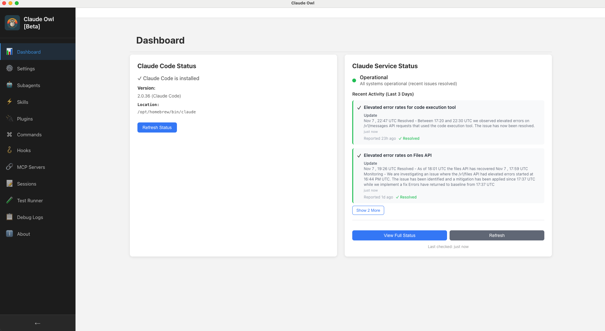
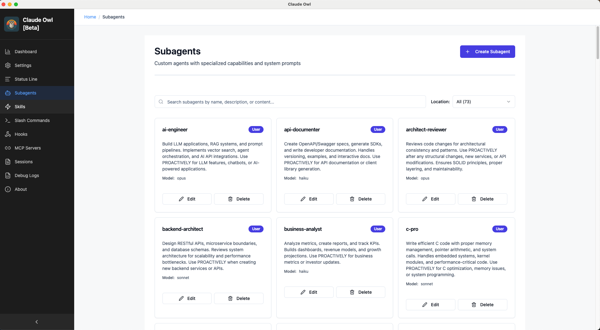
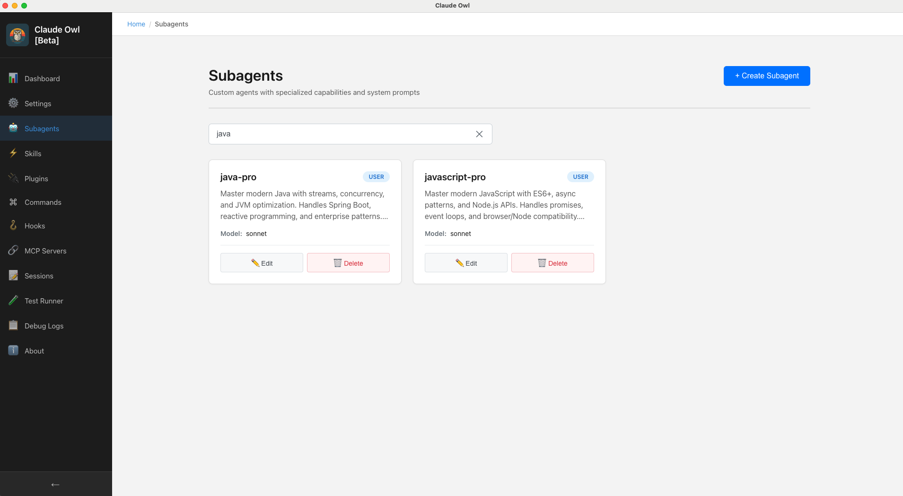
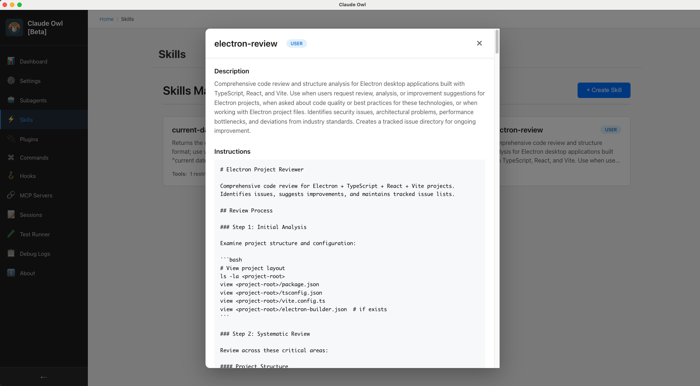
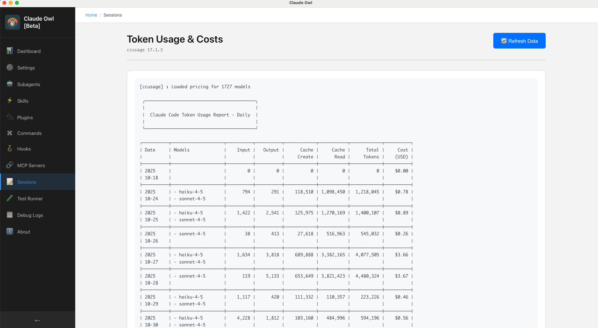
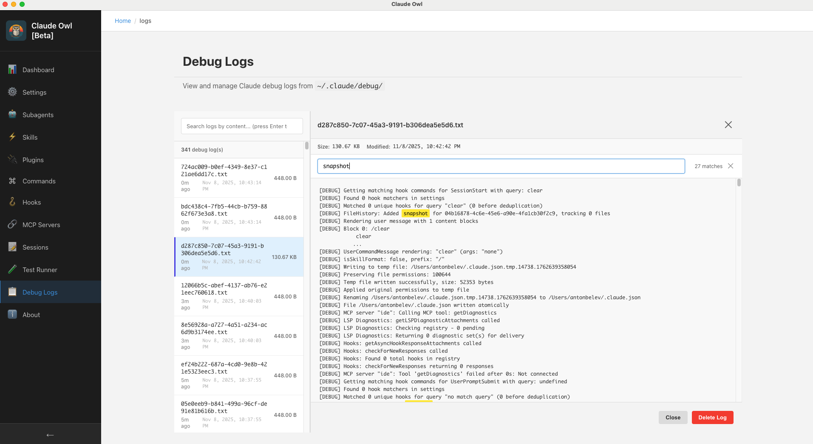
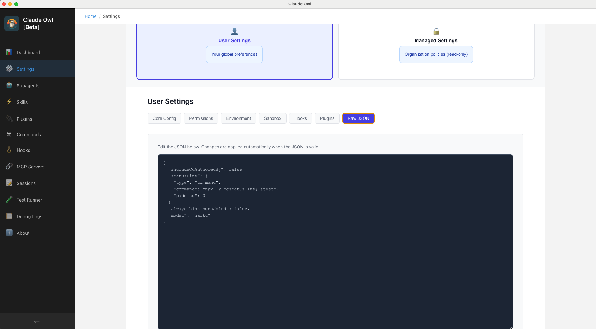
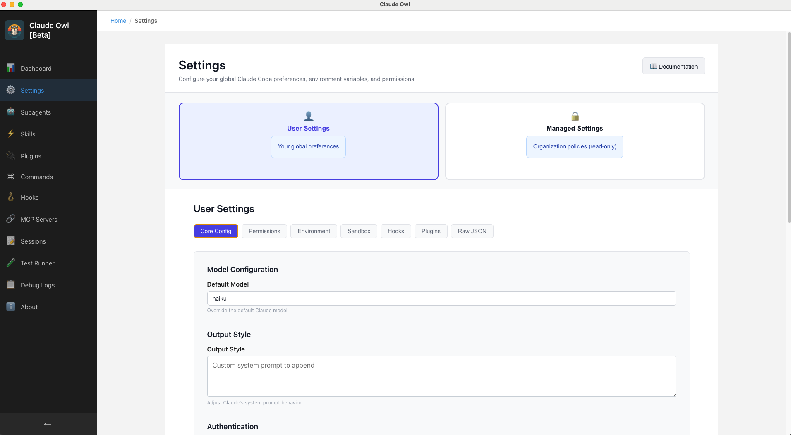
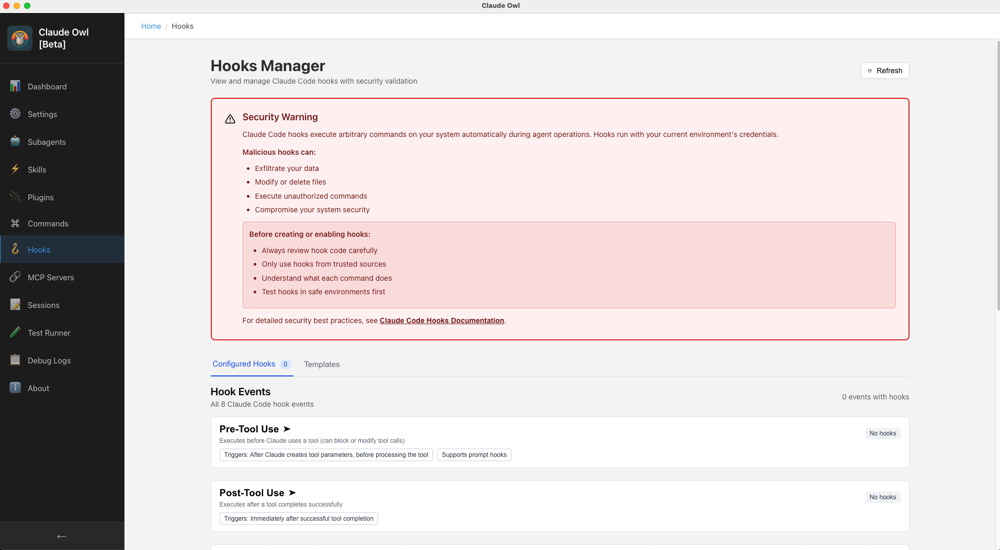

# Claude Owl - Feature Screenshots

This page showcases the current features of Claude Owl in action. Below are screenshots of key UI components and workflows.

## Dashboard

The main dashboard provides an overview of your Claude Code installation and quick access to core features. See at a glance what subagents, skills, and sessions you have configured.

## Subagents Manager

Browse and manage all your custom subagents. The manager provides an intuitive interface for viewing, editing, and organizing subagents without needing to manually edit configuration files.

### Subagents Search

Quickly find subagents by name or description using the built-in search functionality.

## Skills Manager

Manage your agent skills with a visual interface. View available skills, their descriptions, and supporting files all in one place.

## Sessions Monitor

Monitor your Claude Code sessions in real-time. Track usage statistics, view session logs, and analyze performance metrics.

## Debug Logs

Access detailed debug logs from Claude Code operations. Filter, search, and analyze logs to troubleshoot issues and understand application behavior.

## Settings & Configuration

Edit your Claude Code settings through an intuitive visual editor. No more manual JSON editing required.

Configure individual settings with validation and helpful descriptions.

## Hooks Management (Read-Only)

View and manage event-driven hooks configuration. The hooks manager displays your event handlers and their configurations.

---

For more information about features and roadmap, see the [main README](README.md).
