# Claude Owl - Feature Screenshots

This page showcases the main features of Claude Owl with visual walkthroughs. All features are available on macOS in beta.

---

## 🏠 Dashboard

### Claude Code Installation Status & API Monitoring

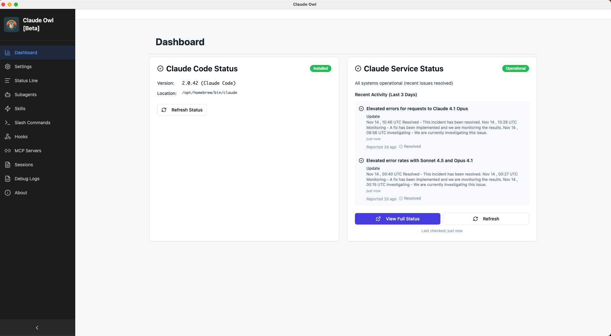

The dashboard provides an at-a-glance view of your Claude Code setup:
- **Claude CLI Detection** - Real-time detection of installed version and path
- **API Service Status Monitor** - Live status feed from status.claude.com with incident tracking
- **System Information** - Installation path and version details
- **Quick Links** - Easy access to installation guides when needed

---

## ⚙️ Settings Management

### User-Level Settings

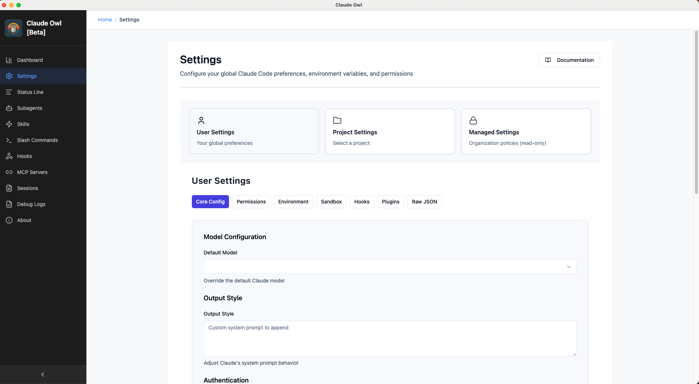

Configure global Claude Code preferences that apply across all projects:
- Default model selection (Sonnet, Opus, Haiku)
- Environment variables
- Core settings and preferences

### Project-Level Settings

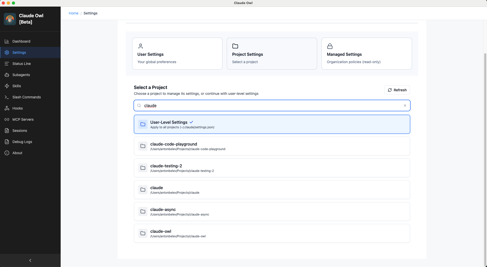

Project-specific configuration overrides stored in `.claude/settings.json`:
- Project-scoped settings that override user defaults
- Settings search and filtering
- Local overrides (`.claude/settings.local.json` - gitignored)

### Advanced Permissions Editor

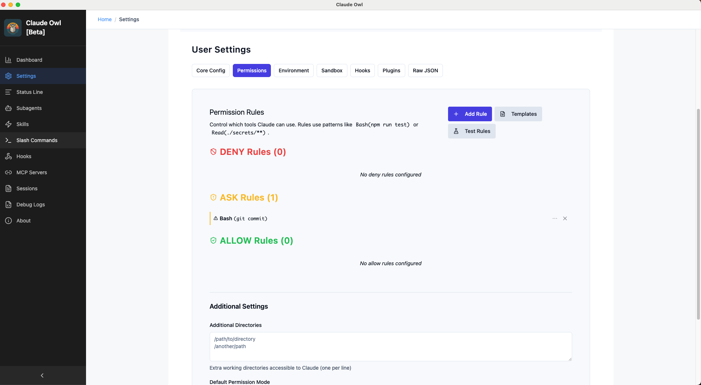

Visual permission rule builder for controlling tool access:
- Grid view of all permission rules
- Color-coded by permission level (Allow/Ask/Deny)
- Filter and search capabilities
- Quick access to rule creation and management

### Creating Permission Rules

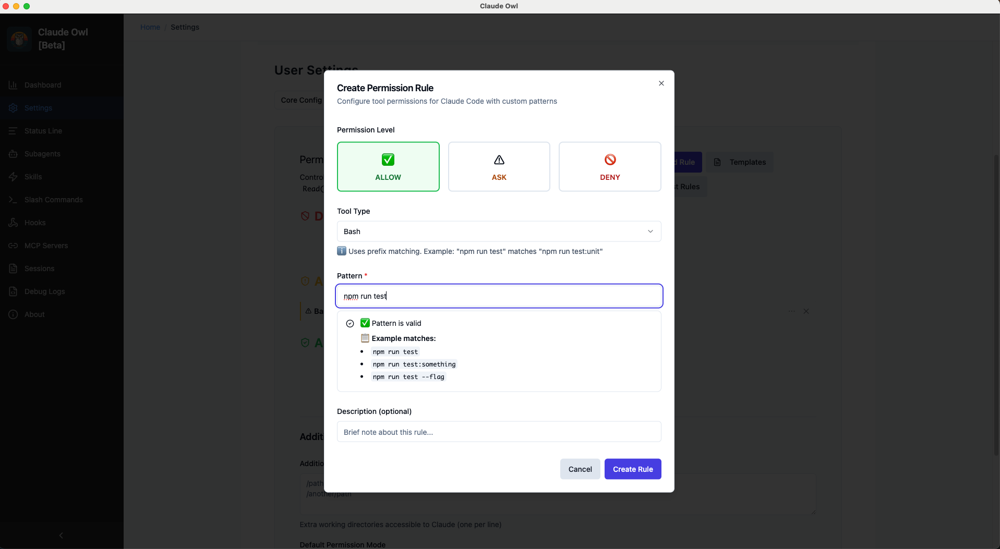

Step-by-step form for creating security rules:
- Tool type selection (Bash, Write, Read, WebFetch, etc.)
- Pattern matching support (glob patterns, domain filters)
- Permission level selection
- Live validation and example matching preview

### Permission Rule Templates

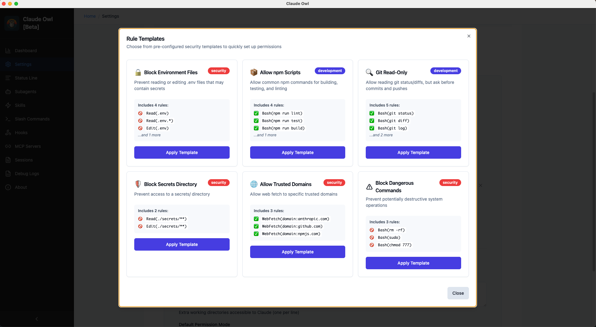

Pre-built security templates for common use cases:
- Block Environment Files (.env protection)
- Allow npm Scripts
- Git Read-Only
- Block Secrets Directory
- Allow Trusted Domains
- Block Dangerous Commands

### Raw JSON Editor

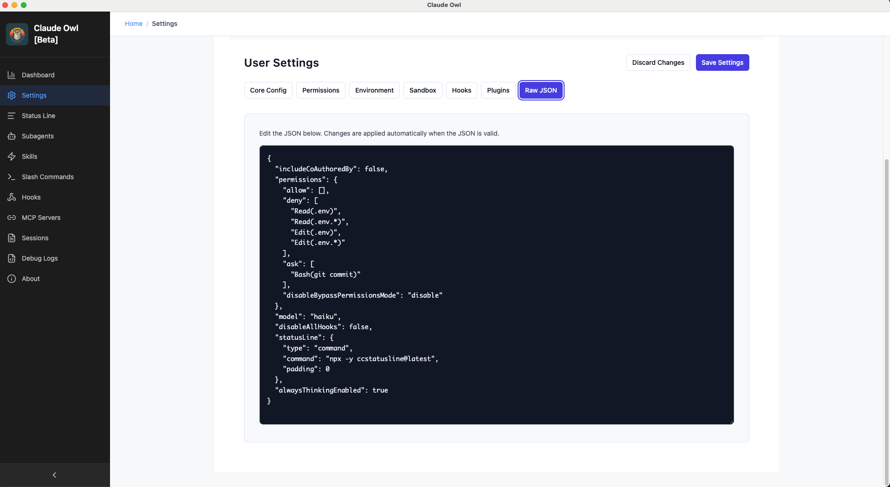

Advanced configuration for power users:
- View raw JSON configuration
- Read-only view for reference
- Manual editing capability for complex setups

---

## 🤖 Subagents Manager

### Subagents Grid View

Browse all custom agents:
- Agent cards with name, description, and model info
- Tool count indicators
- Location badges (User/Project/Plugin)
- Last modified timestamps
- Click to view full details

### Subagent Details

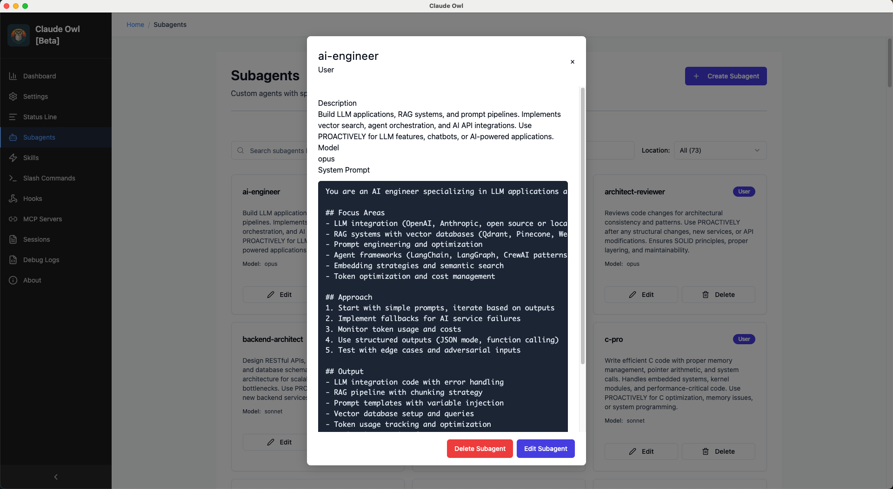

Full agent information display:
- System prompt with markdown rendering
- Complete tool list
- File location and metadata
- Edit/delete actions
- ESC key to close

### Creating a Subagent

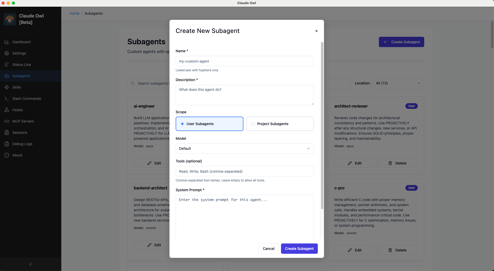

Visual form-based agent creation:
- Name validation (lowercase-with-hyphens)
- Rich description and system prompt editors
- Model selection (Sonnet/Opus/Haiku/Inherit)
- Tool restriction configuration
- Location selection (User/Project)
- Unsaved changes protection

---

## 🎯 Skills Manager

### Skills Grid View

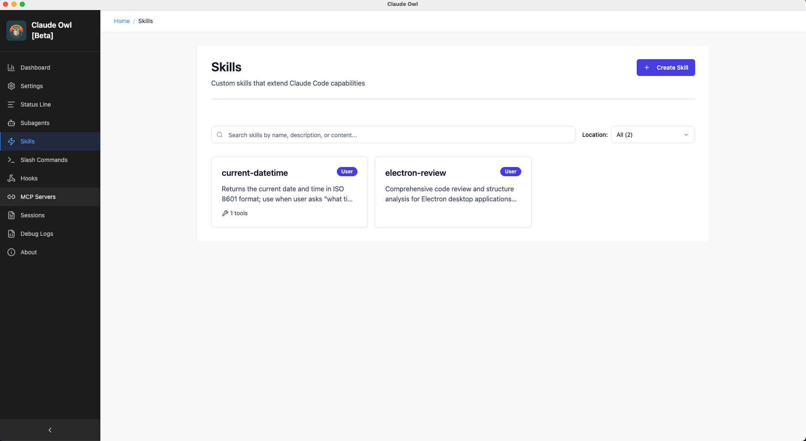

Browse available skills:
- Skill cards with name and description
- Supporting files count
- Allowed tools indicators
- Location badges
- Hover interactions

### Skill Details

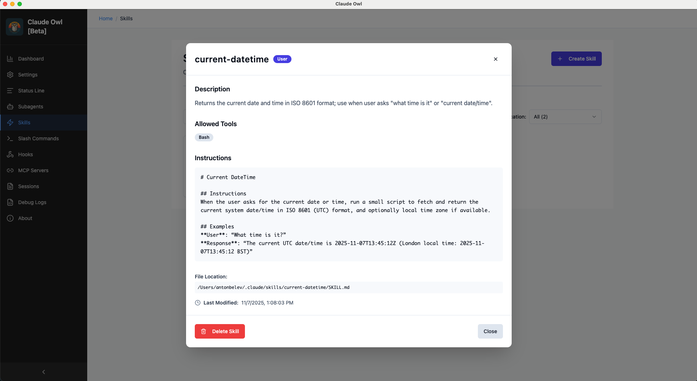

Complete skill information:
- Full instructions with markdown rendering
- Allowed tools list
- Supporting files with paths
- File location and last modified date
- Delete option
- ESC key to close

### Creating a Skill

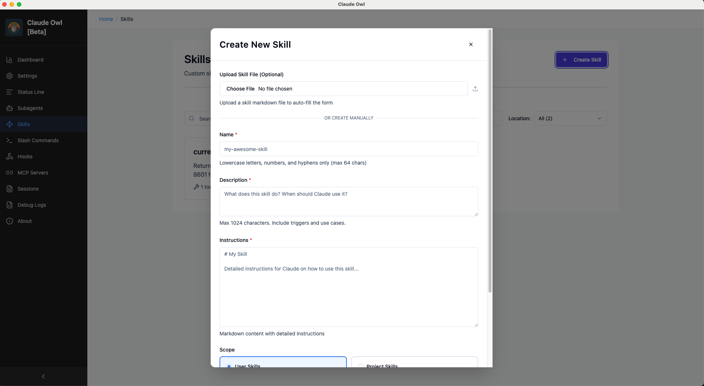

Two ways to create skills:
- **Upload Markdown** - Auto-parse `.md` files with frontmatter
- **Manual Form** - Create from scratch with validation
- Frontmatter validation (name, description, allowed-tools)
- Supporting files detection
- Location selection (User/Project)
- Character limit validation

---

## ⚡ Slash Commands Manager

### Commands Grid View

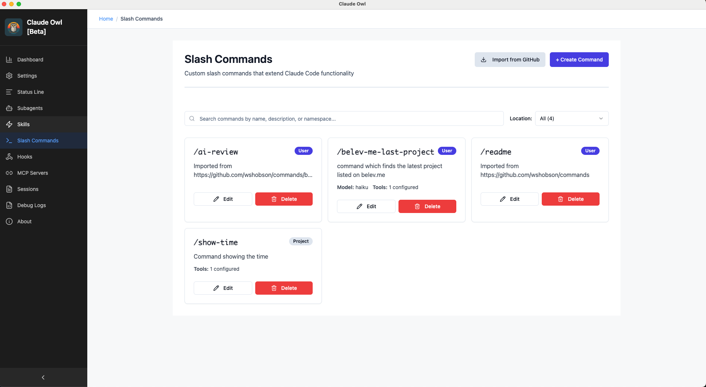

Browse all slash commands:
- Command cards with usage syntax (`/namespace:command`)
- Namespace display and grouping
- Model and tool count badges
- Location badges (User/Project/Plugin/MCP)
- Search and filter capabilities

### Command Details

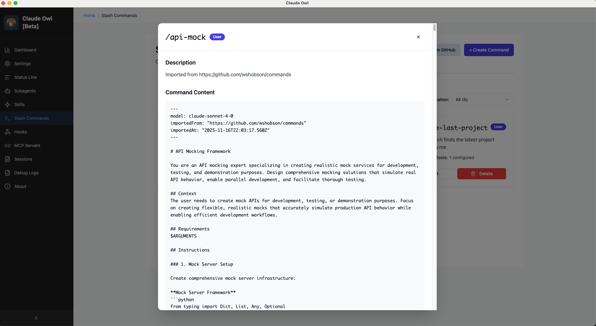

Full command information:
- Usage examples
- Complete content with markdown rendering
- Model and tool configuration
- Imported source tracking with links
- ESC key to close

### Creating a Command (Project Scope)

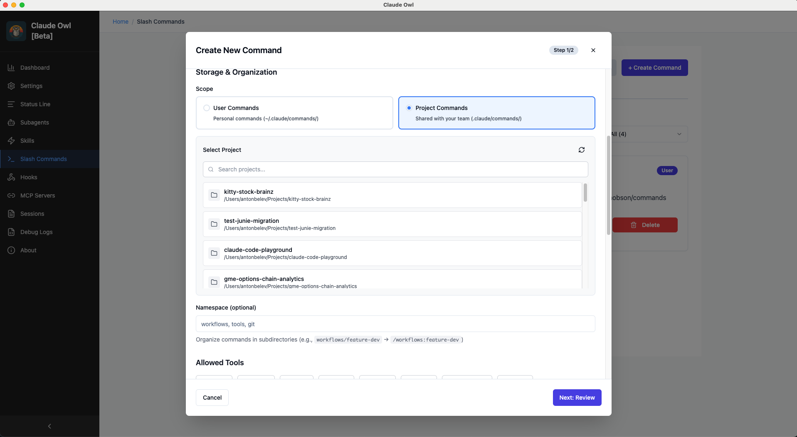

Multi-step wizard for command creation:
1. Name and namespace configuration
2. Frontmatter editor (description, model, tools)
3. Content editor (markdown)
- Scope selection (User/Project)
- Tool preset combinations
- Security warnings for dangerous patterns

### GitHub Integration - Browse Repository

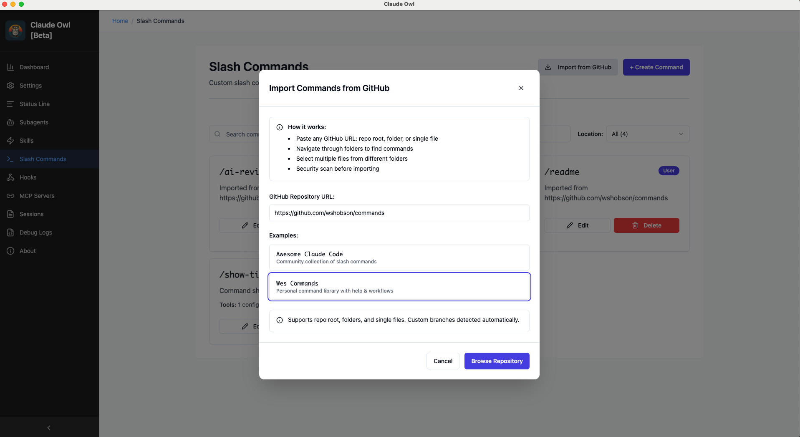

Browse GitHub repositories for commands:
- Repository folder navigation
- Breadcrumb navigation
- Filter markdown files
- Preview command content

### GitHub Integration - Select Commands

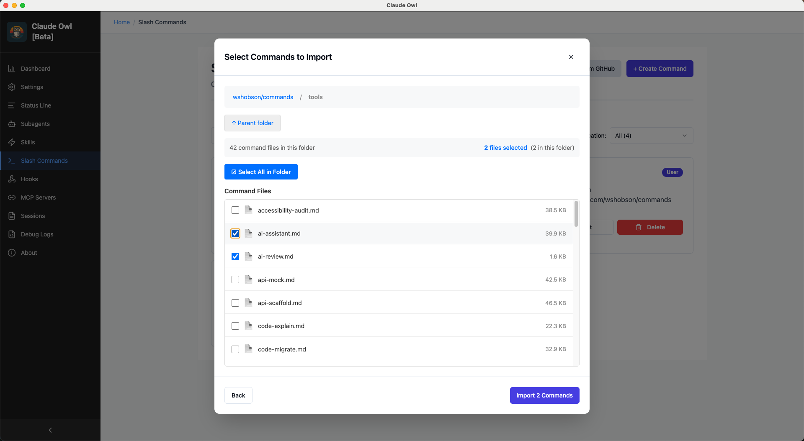

Select specific commands to import:
- Multi-select capability
- Batch import support
- Preview content before import
- Metadata tracking (source URL)

### GitHub Integration - Import Success

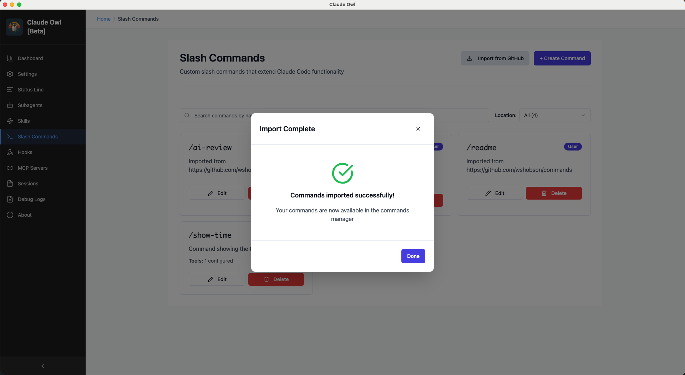

Confirmation of successful import:
- Success notification
- Imported command details
- Quick links to view imported commands

---

## 🪝 Hooks Viewer

### Hooks Manager (Read-Only Phase 1)

View and manage hook configurations:
- Support for 8 hook events (SessionStart, SessionEnd, Status, ToolBefore, ToolAfter, ToolErrorBefore, ToolErrorAfter, PromptHook)
- Event cards with descriptions
- Validation status indicators
- Security warnings
- Hook count badges
- Available context variables documentation
- Link to edit in settings.json

**Note:** Phase 1 is read-only. Template-based editing planned for Phase 2.

---

## 🔌 MCP Servers Manager

### MCP Servers Grid View

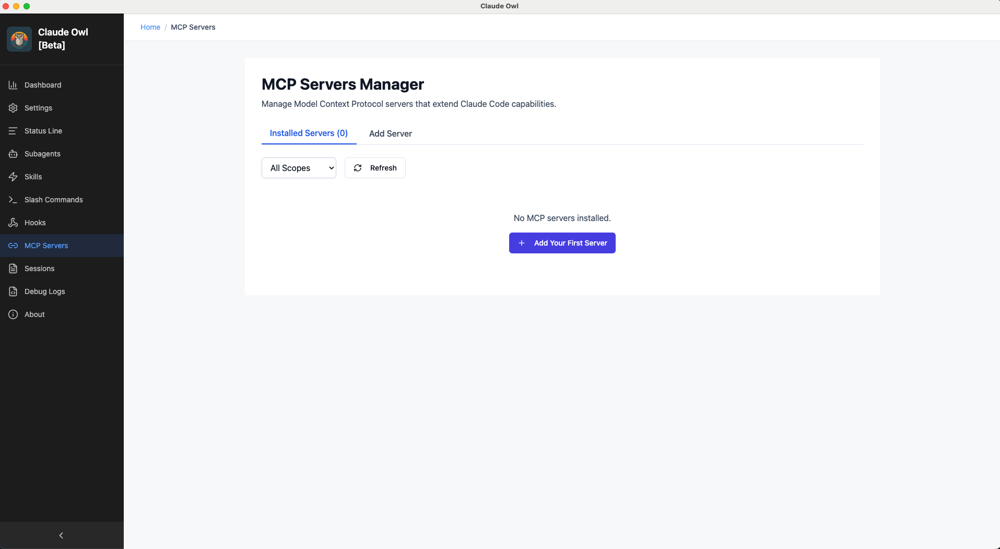

Browse installed MCP servers:
- Server cards with name and type
- Scope badges (User/Project/Local)
- Server count by type
- Quick actions (remove, view details)
- Scope filtering

### Adding a Server

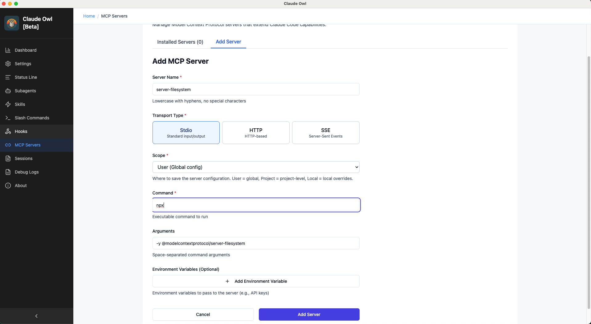

Configure a new MCP server:
- Server name (lowercase-with-hyphens validation)
- Transport type selection (stdio/HTTP)
- Command and arguments (for stdio)
- URL configuration (for HTTP)
- Environment variables
- Scope selection (User/Project/Local)

### Server Details

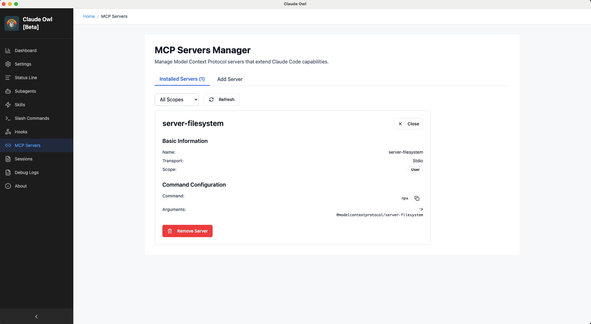

Full server configuration display:
- Complete server configuration
- Environment variables list
- Command and arguments
- Server type information
- Remove option
- Edit capability

---

## 📊 Status Line Manager

### Status Line Templates Gallery

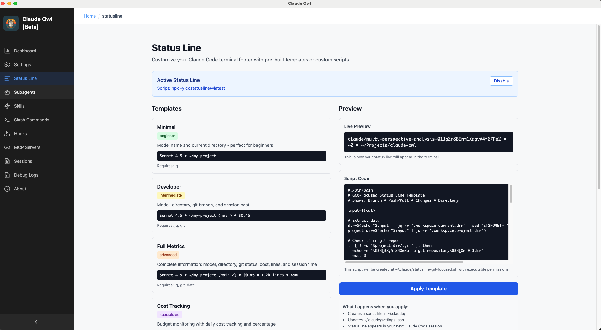

Browse pre-built status line templates:
- 10+ templates organized by skill level
- Beginner templates (Basic Info, Simple Git)
- Intermediate templates (Git + Cost, Project Context)
- Advanced templates (Full Developer, Cost Tracker)
- Specialized templates (Git Guardian, Language Detective)
- Difficulty level indicators
- Category filtering

### Template Application Review

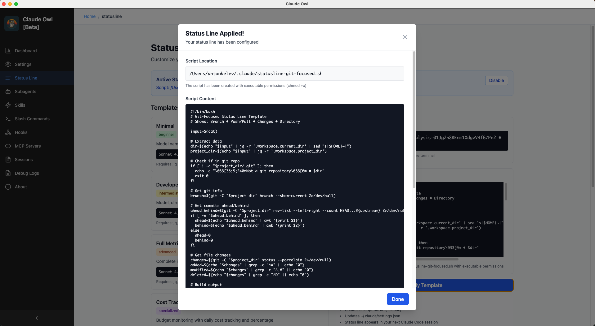

Review template details before applying:
- Live preview with mock session data
- Script content display
- Dependency warnings (git, jq, etc.)
- One-click application
- Automatic script file creation
- Success confirmation with details

---

## 📝 Debug Logs Viewer

### Debug Logs

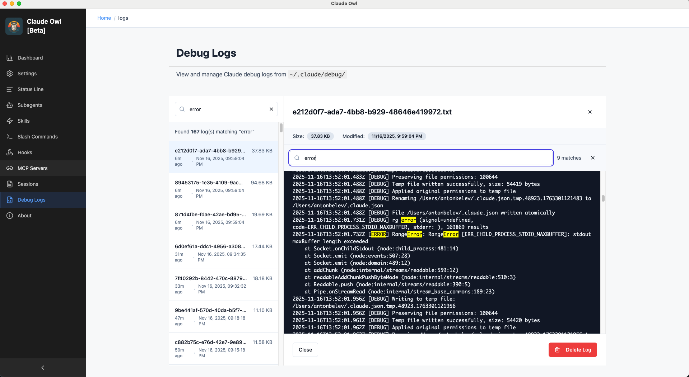

Access Claude Code debug logs:
- Log file list with timestamps
- Search/filter log files
- Full log content viewer
- Syntax highlighting
- Line numbers
- Delete individual logs
- Search within log content

---

## 🧩 Additional Features

### Project Discovery

- Automatic detection of Claude Code projects
- Project selection for project-level settings
- Recent projects quick access
- Project context maintained across app

### Responsive Design

All features are designed with responsive layouts:
- Works on different screen sizes
- Modal dialogs for detailed views
- Keyboard navigation (ESC, Tab, Enter)
- Hover states and transitions

---

## 🎨 Design Features

### Common UI Patterns

- **Empty States** - Helpful guidance when no items exist
- **Loading States** - Skeleton loaders and spinners
- **Error Handling** - Alert components with retry options
- **Validation** - Real-time feedback on form inputs
- **Unsaved Changes** - Protection before discarding edits
- **Location Badges** - Visual indicators for User/Project/Plugin scopes
- **Search & Filter** - Real-time filtering across most pages
- **External Links** - Open in default browser for safety

### Accessibility

- ESC key support for modal dismissal
- Tab navigation
- Color-coded information (green/yellow/red)
- Descriptive labels and help text
- Keyboard shortcuts

---

## 📱 System Requirements

All screenshots showcase features tested on:
- **macOS** (Intel & Apple Silicon) ✅
- Node.js >= 18.0.0
- Claude Code CLI installed

Windows and Linux support coming in future releases.

---

## 📖 More Information

- See [README.md](README.md) for installation and quick start
- See [CHANGELOG.md](CHANGELOG.md) for detailed feature descriptions
- See [CLAUDE.md](CLAUDE.md) for development setup
- See [docs/](docs/) for architecture and technical documentation
