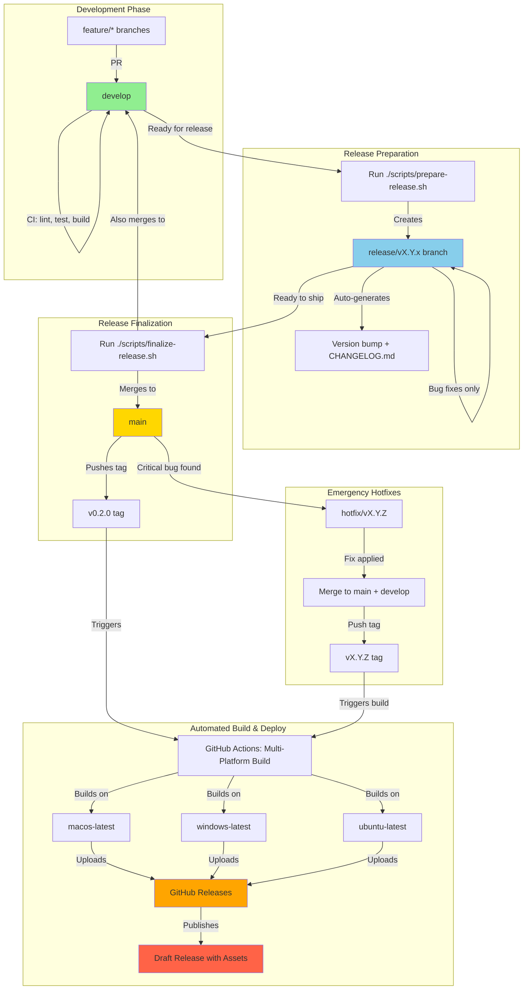

# ADR-006: CI/CD and Release Automation Strategy

**Status:** Accepted
**Date:** 2025-11-17
**Deciders:** Engineering Team, DevOps
**Context:** Release management, branching strategy, and automated deployments for Claude Owl

---

## Context and Problem Statement

Claude Owl is an open-source Electron desktop application that requires:
1. **Multi-platform distribution** (macOS, Windows, Linux)
2. **Reliable release process** with version management and changelog generation
3. **Free hosting** for binaries (GitHub Releases)
4. **Structured branching model** for feature development, releases, and hotfixes
5. **Automated quality gates** before releases
6. **Transparent changelog** for users and contributors

**Key Challenges:**
- Building cross-platform Electron binaries requires platform-specific runners (can't build macOS on Linux)
- Manual version bumping and changelog updates are error-prone
- Need to balance automation with control (avoid accidental releases)
- Open source project requires transparent, auditable release process

---

## Decision Drivers

- **Cost:** Must use free/open-source tools and GitHub's free tier
- **Developer Experience:** Simple workflow for cutting releases
- **Quality:** All releases must pass CI pipeline (lint, typecheck, tests, build)
- **Transparency:** Clear changelog and semantic versioning
- **Multi-platform Support:** Single workflow to build all platforms
- **Security:** Code signing support (future), secure secret management
- **Community:** Standard conventions (SemVer, Conventional Commits, Keep a Changelog)

---

## Considered Options

### Option 1: Manual Releases with GitHub Releases
- ✅ Simple, full control
- ❌ Error-prone, manual version bumping
- ❌ Inconsistent changelogs
- ❌ Doesn't scale with contributors

### Option 2: Fully Automated with semantic-release
- ✅ Zero human intervention
- ✅ Automated versioning from commits
- ❌ Too aggressive (publishes on every merge to main)
- ❌ Less control over release timing
- ❌ Requires strict commit message discipline from all contributors

### Option 3: Semi-Automated with standard-version (CHOSEN)
- ✅ Developer triggers release with script
- ✅ Automated version bump and changelog from conventional commits
- ✅ Control over when releases happen
- ✅ Can review/edit before pushing
- ✅ Industry standard (used by Vue, Angular, etc.)

### Option 4: GitLab CI / Jenkins / CircleCI
- ❌ Additional services to maintain
- ❌ Cost (for private repos or advanced features)
- ✅ GitHub Actions is free for public repos and integrated

---

## Decision Outcome

**Chosen Option:** Semi-automated release process with GitFlow-inspired branching strategy, GitHub Actions multi-platform builds, and standard-version for changelog generation.

---

## Branching Strategy

### Branch Types

```
main (protected)
  ↑
  └── release/v0.2.x (protected, triggers builds)
        ↑
        ├── develop (default branch, where PRs merge)
        │     ↑
        │     ├── feature/add-mcp-marketplace
        │     ├── feature/slash-commands-ui
        │     └── fix/settings-validation-bug
        │
        └── hotfix/v0.1.1-critical-security-fix (emergency only)
```

### Branch Descriptions

1. **`main`** (protected)
   - Always reflects production state
   - Only accepts merges from `release/*` or `hotfix/*` branches
   - Tagged with version numbers (v0.1.0, v0.2.0, etc.)
   - Triggers production release builds

2. **`develop`** (default branch, protected)
   - Integration branch for features
   - Where all feature PRs merge
   - CI runs on every push (lint, typecheck, tests, build)
   - Must always be in working state

3. **`release/vX.Y.x`** (protected)
   - Created from `develop` when ready for release
   - Naming: `release/v0.2.x`, `release/v1.0.x`
   - Only bug fixes allowed (no new features)
   - Merged to both `main` AND `develop` when ready
   - Triggers release candidate builds

4. **`feature/*`** (short-lived)
   - Created from `develop`
   - Naming: `feature/description` (e.g., `feature/mcp-marketplace`)
   - Merged back to `develop` via PR
   - Deleted after merge

5. **`hotfix/*`** (emergency only)
   - Created from `main` for critical production bugs
   - Naming: `hotfix/vX.Y.Z-description` (e.g., `hotfix/v0.1.1-security-fix`)
   - Merged to both `main` AND `develop`
   - Increments PATCH version

---

## Release Workflow

### Overview Diagram



### Detailed Workflow Steps

#### Step 1: Feature Development (Daily)

```bash
# Create feature branch from develop
git checkout develop
git pull origin develop
git checkout -b feature/my-awesome-feature

# Develop with conventional commits
git commit -m "feat(mcp): add marketplace browser UI"
git commit -m "fix(settings): validate permission rules before save"
git commit -m "docs: update MCP installation guide"

# Push and create PR to develop
git push -u origin feature/my-awesome-feature
# Create PR via GitHub UI → merges to develop after review
```

**Conventional Commit Types:**
- `feat:` New feature (→ MINOR version bump)
- `fix:` Bug fix (→ PATCH version bump)
- `docs:` Documentation only
- `style:` Formatting, missing semicolons
- `refactor:` Code restructuring
- `perf:` Performance improvement
- `test:` Adding tests
- `chore:` Build process, dependencies
- `BREAKING CHANGE:` in footer (→ MAJOR version bump)

#### Step 2: Prepare Release (When Ready)

```bash
# Run the release preparation script
./scripts/prepare-release.sh minor  # or major, patch

# This script:
# 1. Checks out develop, pulls latest
# 2. Runs CI checks locally (lint, typecheck, tests, build)
# 3. Creates release branch (e.g., release/v0.2.x)
# 4. Runs standard-version to:
#    - Analyze commits since last release
#    - Bump version in package.json (0.1.0 → 0.2.0)
#    - Generate CHANGELOG.md entries
#    - Create commit "chore(release): 0.2.0"
# 5. Pushes release branch to GitHub
# 6. Prints next steps
```

**Example Output:**
```
🚀 Release Preparation Complete!

Branch: release/v0.2.x
Version: 0.2.0
Changelog: Updated with 23 new entries

Next Steps:
1. Review CHANGELOG.md for accuracy
2. Make any final bug fixes on this branch
3. Run ./scripts/finalize-release.sh when ready to publish
```

#### Step 3: Release Candidate Testing (Optional)

```bash
# If bugs found during QA on release branch
git checkout release/v0.2.x
git commit -m "fix(ui): correct alignment in settings dialog"
git push origin release/v0.2.x

# Re-run prepare script to update changelog
./scripts/prepare-release.sh patch  # bumps to 0.2.1 if needed
```

#### Step 4: Finalize and Publish Release

```bash
# When release branch is perfect
./scripts/finalize-release.sh

# This script:
# 1. Merges release/v0.2.x → main
# 2. Tags main with v0.2.0
# 3. Pushes tag (triggers GitHub Actions build)
# 4. Merges release/v0.2.x → develop (keeps develop up to date)
# 5. Deletes release branch
# 6. Prints release URL
```

**GitHub Actions Automatically:**
1. Detects `v*` tag push
2. Runs CI pipeline (quality gates)
3. Builds macOS, Windows, Linux in parallel
4. Uploads `.dmg`, `.exe`, `.AppImage` to GitHub Releases
5. Creates draft release with auto-generated notes
6. Maintainer reviews and publishes

#### Step 5: Hotfix (Emergency Only)

```bash
# Critical security bug in production (v0.2.0)
git checkout main
git checkout -b hotfix/v0.2.1-security-fix

# Fix the bug
git commit -m "fix(security): sanitize file paths to prevent traversal"

# Run hotfix script
./scripts/hotfix.sh

# This merges to both main and develop, tags v0.2.1
```

---

## Technical Implementation

### Tooling Choices

#### 1. standard-version (Changelog & Versioning)
```json
{
  "devDependencies": {
    "standard-version": "^9.5.0"
  },
  "scripts": {
    "release": "standard-version",
    "release:minor": "standard-version --release-as minor",
    "release:major": "standard-version --release-as major",
    "release:patch": "standard-version --release-as patch"
  }
}
```

**Why standard-version?**
- ✅ Industry standard (Vue, Angular, Nest.js)
- ✅ Respects `CHANGELOG.md` format (Keep a Changelog)
- ✅ Integrates with conventional commits
- ✅ Allows manual control (vs semantic-release's full automation)
- ✅ Single command for version + changelog

#### 2. GitHub Actions Multi-Platform Matrix

```yaml
strategy:
  matrix:
    include:
      - os: macos-latest
        platform: mac
        artifact: '*.dmg'
      - os: windows-latest
        platform: win
        artifact: '*.exe'
      - os: ubuntu-latest
        platform: linux
        artifact: '*.AppImage'
```

**Why matrix builds?**
- ✅ Parallel execution (faster releases)
- ✅ Platform-native builds (macOS needs macOS runner)
- ✅ Consistent environment (GitHub-hosted runners)
- ✅ Free for public repos

#### 3. GitHub Releases (Binary Hosting)

**Why GitHub Releases?**
- ✅ Free unlimited hosting for public repos
- ✅ Built-in auto-update support with electron-builder
- ✅ Version tagging integration
- ✅ Release notes from CHANGELOG.md
- ✅ Download stats and community visibility

---

## Configuration Files

### 1. `.versionrc.json` (standard-version config)

```json
{
  "header": "# Changelog\n\nAll notable changes to Claude Owl will be documented in this file.\n\nThe format is based on [Keep a Changelog](https://keepachangelog.com/en/1.0.0/),\nand this project adheres to [Semantic Versioning](https://semver.org/spec/v2.0.0.html).\n\n",
  "types": [
    { "type": "feat", "section": "✨ Features" },
    { "type": "fix", "section": "🐛 Bug Fixes" },
    { "type": "perf", "section": "⚡ Performance" },
    { "type": "docs", "section": "📚 Documentation", "hidden": false },
    { "type": "style", "hidden": true },
    { "type": "refactor", "section": "♻️ Refactoring", "hidden": false },
    { "type": "test", "hidden": true },
    { "type": "chore", "hidden": true }
  ],
  "commitUrlFormat": "https://github.com/antonbelev/claude-owl/commit/{{hash}}",
  "compareUrlFormat": "https://github.com/antonbelev/claude-owl/compare/{{previousTag}}...{{currentTag}}",
  "issueUrlFormat": "https://github.com/antonbelev/claude-owl/issues/{{id}}",
  "scripts": {
    "prerelease": "npm run format && npm run lint && npm run typecheck && npm run test:unit && npm run build"
  }
}
```

### 2. `electron-builder.json` (Updated with publish config)

```json
{
  "appId": "com.claudeowl.app",
  "productName": "Claude Owl",
  "directories": {
    "output": "release/${version}"
  },
  "files": ["dist/**/*", "package.json"],
  "publish": {
    "provider": "github",
    "owner": "antonbelev",
    "repo": "claude-owl",
    "releaseType": "draft"
  },
  "mac": {
    "category": "public.app-category.developer-tools",
    "target": [
      { "target": "dmg", "arch": ["x64", "arm64"] }
    ],
    "icon": "assets/icon.icns"
  },
  "win": {
    "target": ["nsis"],
    "icon": "assets/icon.ico"
  },
  "linux": {
    "target": ["AppImage"],
    "category": "Development",
    "icon": "assets/icon.png"
  }
}
```

### 3. GitHub Actions Workflow (`.github/workflows/release.yml`)

See separate workflow file (created in next step).

---

## Security Considerations

### Code Signing (Future Phase 2)

**macOS:**
```yaml
env:
  APPLE_ID: ${{ secrets.APPLE_ID }}
  APPLE_APP_SPECIFIC_PASSWORD: ${{ secrets.APPLE_PASSWORD }}
  CSC_LINK: ${{ secrets.MAC_CERT_BASE64 }}
  CSC_KEY_PASSWORD: ${{ secrets.MAC_CERT_PASSWORD }}
```

**Windows:**
```yaml
env:
  WIN_CSC_LINK: ${{ secrets.WIN_CERT_BASE64 }}
  WIN_CSC_KEY_PASSWORD: ${{ secrets.WIN_CERT_PASSWORD }}
```

### Protected Branches

**Required Status Checks:**
- ✅ Lint must pass
- ✅ TypeCheck must pass
- ✅ Unit Tests must pass
- ✅ Build must succeed

**Branch Protection Rules:**
- `main`: No direct pushes, require PR review, require status checks
- `develop`: No direct pushes, require PR review, require status checks
- `release/*`: No direct pushes, require PR review

---

## Release Cadence

### Versioning Scheme (SemVer)

**MAJOR.MINOR.PATCH** (e.g., 1.2.3)

- **MAJOR:** Breaking changes (e.g., 1.0.0 → 2.0.0)
  - API changes that break backward compatibility
  - Major architecture changes
  - Removal of deprecated features

- **MINOR:** New features (e.g., 0.1.0 → 0.2.0)
  - New functionality added
  - Non-breaking enhancements
  - Scheduled every 2-4 weeks

- **PATCH:** Bug fixes (e.g., 0.1.0 → 0.1.1)
  - Bug fixes
  - Security patches
  - Performance improvements
  - As needed

### Pre-Release Labels

- `v0.1.0-alpha.1` - Internal testing
- `v0.1.0-beta.1` - Public beta testing
- `v0.1.0-rc.1` - Release candidate

### Release Schedule (Recommended)

- **Minor releases:** Every 2-4 weeks (feature batching)
- **Patch releases:** As needed (bug fixes, security)
- **Major releases:** When breaking changes accumulate (6-12 months)

---

## Rollback Strategy

### If Release Build Fails

```bash
# Delete the tag
git tag -d v0.2.0
git push origin :refs/tags/v0.2.0

# Delete the release branch
git branch -D release/v0.2.x
git push origin --delete release/v0.2.x

# Fix issues on develop, then restart release process
```

### If Released Version Has Critical Bug

```bash
# Create hotfix branch from main
git checkout main
git checkout -b hotfix/v0.2.1-critical-fix

# Fix and release as patch
./scripts/hotfix.sh
```

### If Bad Release Published

1. **Mark release as "Pre-release"** in GitHub UI (warning to users)
2. **Create hotfix** for next patch version
3. **Update release notes** with known issues
4. **Communicate** via GitHub Discussions / Discord / Twitter

---

## Success Metrics

### Quality Metrics
- ✅ 100% of releases pass CI before publish
- ✅ Zero manual version/changelog edits (automated)
- ✅ < 24 hours from release decision to published binaries

### Transparency Metrics
- ✅ Every release has complete changelog
- ✅ All commits follow conventional commit format
- ✅ Release notes auto-generated from commits

### Developer Metrics
- ✅ < 5 minutes to prepare release (script automation)
- ✅ < 10 minutes for multi-platform builds (GitHub Actions)
- ✅ Zero deployment keys on developer machines (GitHub secrets)

---

## Future Enhancements (Post-MVP)

### Phase 2: Code Signing
- [ ] Apple Developer Program enrollment ($99/year)
- [ ] Windows Code Signing Certificate (Sectigo, DigiCert)
- [ ] Automated notarization (macOS)
- [ ] SmartScreen reputation building (Windows)

### Phase 3: Auto-Updates
- [ ] electron-updater integration
- [ ] Update server configuration (GitHub Releases supports this)
- [ ] In-app update notifications
- [ ] Rollback mechanism for bad updates

### Phase 4: Advanced Analytics
- [ ] Download count tracking
- [ ] Platform distribution metrics (% macOS vs Windows vs Linux)
- [ ] Update adoption rates
- [ ] Crash reporting (Sentry integration)

### Phase 5: Nightly Builds
- [ ] Scheduled builds from `develop` (daily at 2 AM UTC)
- [ ] Beta channel for early adopters
- [ ] Canary releases for testing

---

## References

- [Semantic Versioning 2.0.0](https://semver.org/)
- [Conventional Commits 1.0.0](https://www.conventionalcommits.org/)
- [Keep a Changelog](https://keepachangelog.com/)
- [GitFlow Workflow](https://www.atlassian.com/git/tutorials/comparing-workflows/gitflow-workflow)
- [electron-builder Documentation](https://www.electron.build/)
- [standard-version GitHub](https://github.com/conventional-changelog/standard-version)
- [GitHub Actions: Building and testing Node.js](https://docs.github.com/en/actions/automating-builds-and-tests/building-and-testing-nodejs)

---

## Consequences

### Positive

✅ **Consistent Releases:** Every release follows the same validated process
✅ **Multi-Platform Support:** Single workflow builds for all platforms
✅ **Free Hosting:** GitHub Releases provides unlimited hosting for binaries
✅ **Transparent Changelog:** Auto-generated from commits (no manual editing)
✅ **Quality Gates:** CI must pass before any release
✅ **Developer Friendly:** Two simple scripts (`prepare-release.sh`, `finalize-release.sh`)
✅ **Community Standard:** Uses industry-standard tools and conventions
✅ **Rollback Safety:** Can revert releases without data loss

### Negative

⚠️ **Learning Curve:** Contributors must learn conventional commits
⚠️ **Commit Discipline:** Requires well-formed commit messages
⚠️ **Build Time:** Multi-platform builds take ~15-20 minutes (vs single platform)
⚠️ **Branch Management:** More complex than trunk-based development

### Neutral

➡️ **Semi-Manual Process:** Developer must trigger releases (not fully automated)
➡️ **GitHub Dependency:** Tightly coupled to GitHub ecosystem
➡️ **No Code Signing Yet:** Phase 1 ships unsigned binaries (macOS warnings)

---

## Implementation Checklist

- [ ] Add `standard-version` to devDependencies
- [ ] Create `.versionrc.json` configuration
- [ ] Update `electron-builder.json` with publish settings
- [ ] Create `scripts/prepare-release.sh`
- [ ] Create `scripts/finalize-release.sh`
- [ ] Create `scripts/hotfix.sh`
- [ ] Update `.github/workflows/release.yml` for multi-platform builds
- [ ] Protect `main` and `develop` branches in GitHub settings
- [ ] Create `develop` branch from `main`
- [ ] Update `CONTRIBUTING.md` with branching strategy and commit conventions
- [ ] Add release workflow diagram to README.md
- [ ] Test release process on feature branch before production use

---

**Status:** ✅ Accepted
**Next Steps:** Implement scripts and updated workflows
**Review Date:** After first 3 releases (evaluate effectiveness)
