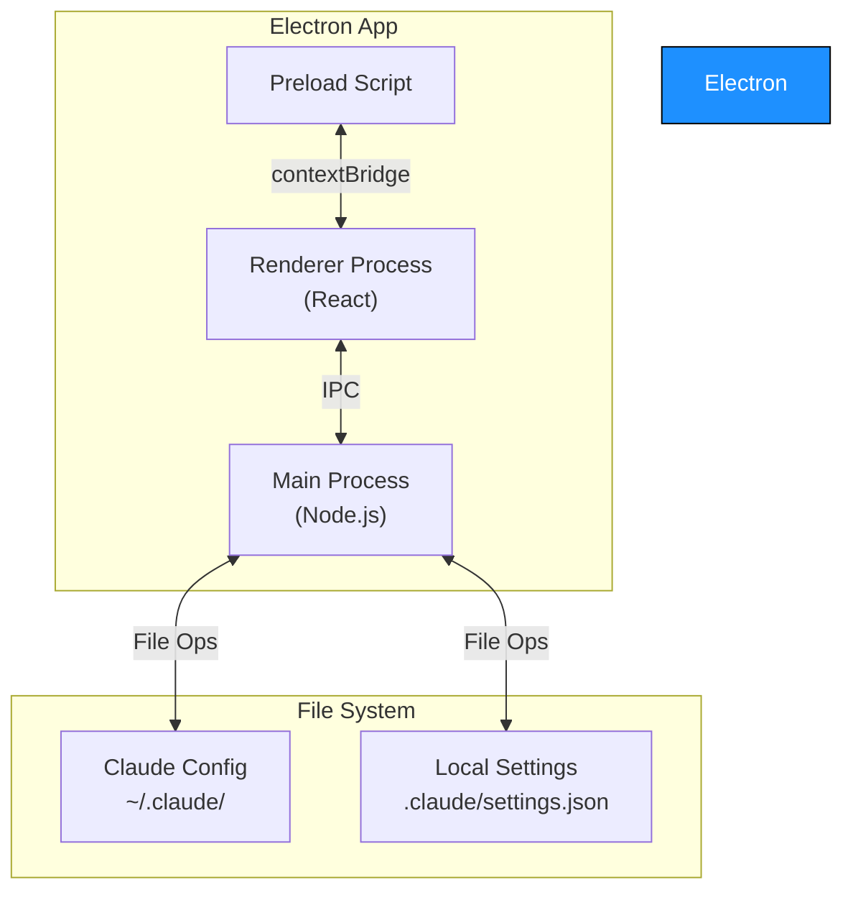
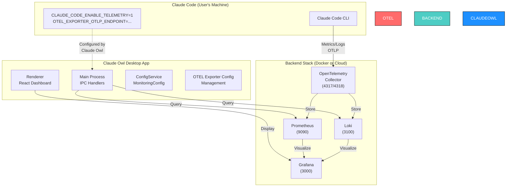
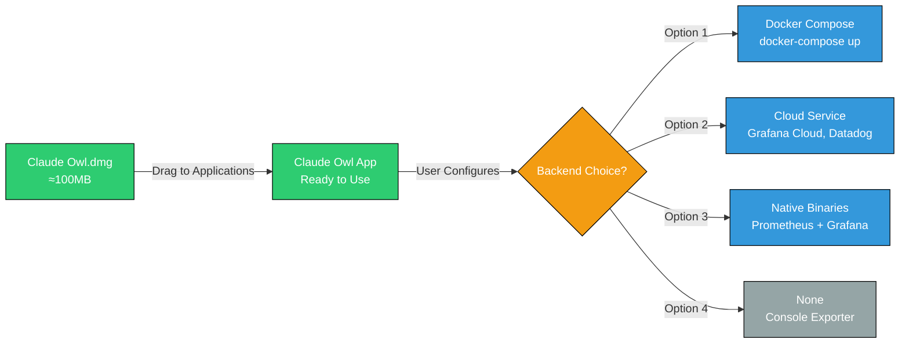
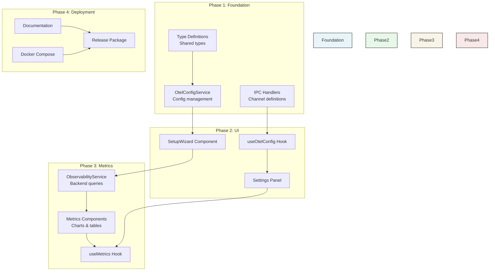

# OpenTelemetry Metrics Implementation for Claude Owl

**Date:** November 2025
**Status:** Investigation & Architecture Design
**Scope:** Implementing OTEL metrics and statistics for Claude Code monitoring

## Executive Summary

Claude Owl can integrate OpenTelemetry (OTEL) to provide comprehensive monitoring, metrics collection, and usage statistics for Claude Code sessions. This document explores:

1. **What's technically possible** - Implementation approach and integration points
2. **Architecture design** - How metrics flow from Claude Code through Claude Owl to observability backend
3. **Docker requirements** - Whether containerization is necessary
4. **DMG distribution impact** - Implications for shipping Claude Owl as a standalone macOS app

**Key Finding:** Claude Owl can become an observability frontend for Claude Code without requiring Docker for local development, but a Docker-based backend is recommended for production monitoring.

---

## Table of Contents

1. [Investigation Findings](#investigation-findings)
2. [Architecture Design](#architecture-design)
3. [Docker Requirements Assessment](#docker-requirements-assessment)
4. [DMG Distribution Implications](#dmg-distribution-implications)
5. [Implementation Plan](#implementation-plan)
6. [Security & Privacy Considerations](#security--privacy-considerations)

---

## Investigation Findings

### Claude Code OTEL Support

From official Claude Code documentation:

#### Telemetry Activation
```bash
export CLAUDE_CODE_ENABLE_TELEMETRY=1
```

#### Available Exporters
- **OTLP/gRPC**: `http://localhost:4317` (recommended, lower overhead)
- **OTLP HTTP**: `http://localhost:4318/v1/metrics` and `/v1/logs`
- **Prometheus**: Direct scrape support
- **Console**: For debugging

#### Metrics Collected by Claude Code
Claude Code exports rich telemetry including:

| Metric Category | Details |
|---|---|
| **Session Metrics** | Session count, active time, duration |
| **Code Changes** | Lines added/removed, files modified |
| **Git Activity** | Commits created, pull requests opened |
| **Token Usage** | Input tokens, output tokens, cache reads, cache creation tokens |
| **API Activity** | Requests by model version, success/failure rates, latency |
| **Cost Tracking** | USD cost per session (approximate, model-aware) |
| **Tool Execution** | Tool acceptance/rejection rates, success rates, timing |
| **Events** | User prompts, API requests, tool results, permission decisions |

#### Configuration Endpoints
- **Default Interval:** 60 seconds for metrics, 5 seconds for logs
- **Authentication:** `OTEL_EXPORTER_OTLP_HEADERS` for bearer tokens/API keys
- **Protocol Options:** gRPC or HTTP/Protobuf

### Reference Implementation: claude-code-otel

The [ColeMurray/claude-code-otel](https://github.com/ColeMurray/claude-code-otel) project demonstrates a production-ready setup:

#### Stack Components
- **OpenTelemetry Collector** (ports 4317/gRPC, 4318/HTTP)
- **Prometheus** (port 9090) - metrics storage
- **Loki** (port 3100) - log aggregation
- **Grafana** (port 3000) - visualization & dashboards

#### Key Implementation Details
- Uses **Docker Compose** for easy orchestration
- Pre-configured Grafana dashboards for:
  - Cost trends and model-specific spending
  - Productivity metrics (PRs, commits, code changes)
  - Tool usage patterns and performance
  - Real-time error tracking
  - Session analytics
- Privacy controls: prompts disabled by default
- Single command startup: `docker-compose up`

---

## Architecture Design

### Current Claude Owl Architecture



### Proposed OTEL Integration Architecture



### Data Flow in Detail

#### 1. Configuration Phase (Claude Owl)
```
User -> Claude Owl UI -> MonitoringConfig Service
    ↓
    Write OTEL env vars to ~/.claude/settings.json
    ↓
    Preload script exposes config management API
    ↓
    Renderer displays monitoring dashboard
```

#### 2. Metrics Collection Phase (Claude Code)
```
Claude Code CLI executes user commands
    ↓
    Reads CLAUDE_CODE_ENABLE_TELEMETRY=1
    ↓
    Collects metrics (sessions, tokens, costs, git activity)
    ↓
    Exports via OTEL to configured endpoint (localhost:4317)
    ↓
    OpenTelemetry Collector receives data
```

#### 3. Storage & Visualization Phase
```
Collector processes and batches metrics
    ↓
    Stores in Prometheus (time-series metrics)
    Stores in Loki (logs and events)
    ↓
    Grafana queries both sources
    ↓
    Claude Owl fetches Grafana API for dashboards/data
```

### Integration Points in Claude Owl

#### Service Layer (`src/main/services/`)

**New: `OtelConfigService`**
```typescript
// Manages OTEL configuration
class OtelConfigService {
  // Read/write OTEL settings to ~/.claude/settings.json
  getOtelConfig(): OtelConfiguration
  updateOtelConfig(config: OtelConfiguration): Promise<void>

  // Validation
  validateOtelEndpoint(endpoint: string): Promise<boolean>
  testConnection(): Promise<ConnectionTestResult>

  // Preset configurations
  getPresets(): OtelPreset[]  // local, cloud, cloud+prometheus, etc.
  applyPreset(name: string): Promise<void>
}
```

**New: `ObservabilityService`**
```typescript
// Queries observability backends
class ObservabilityService {
  // Prometheus queries
  getMetrics(query: string, timeRange: TimeRange): Promise<MetricData>
  getCostTrends(period: 'day' | 'week' | 'month'): Promise<CostData>
  getTokenUsage(): Promise<TokenMetrics>

  // Loki queries
  getLogs(filter: string, timeRange: TimeRange): Promise<LogEntry[]>
  getEvents(type: string, limit?: number): Promise<Event[]>

  // Grafana integration
  getAvailableDashboards(): Promise<Dashboard[]>
  getDashboard(uid: string): Promise<DashboardData>
}
```

#### IPC Channels (New)

```typescript
// src/shared/types/ipc.types.ts
export const OTEL_CHANNELS = {
  // Configuration
  GET_OTEL_CONFIG: 'otel:get-config',
  UPDATE_OTEL_CONFIG: 'otel:update-config',
  TEST_OTEL_CONNECTION: 'otel:test-connection',
  APPLY_PRESET: 'otel:apply-preset',

  // Metrics
  GET_COST_METRICS: 'otel:get-cost-metrics',
  GET_TOKEN_METRICS: 'otel:get-token-metrics',
  GET_SESSION_METRICS: 'otel:get-session-metrics',

  // Logs & Events
  GET_EVENTS: 'otel:get-events',
  GET_LOGS: 'otel:get-logs',
};
```

#### React Components (New)

```
src/renderer/components/monitoring/
├── OtelSetupWizard.tsx          # Configure OTEL backend
├── MonitoringDashboard.tsx       # Main metrics view
├── MetricsPanel.tsx              # Cost, tokens, sessions
├── EventsPanel.tsx               # Event log viewer
├── PresetConfigurator.tsx        # Quick setup templates
└── ConnectionStatus.tsx           # Backend connectivity
```

#### React Hooks (New)

```typescript
// src/renderer/hooks/useOtelConfig.ts
function useOtelConfig()
  - config: OtelConfiguration | null
  - loading: boolean
  - error: Error | null
  - updateConfig(config: OtelConfiguration): Promise<void>
  - testConnection(): Promise<boolean>

// src/renderer/hooks/useMetrics.ts
function useMetrics(type: 'cost' | 'tokens' | 'sessions', timeRange: TimeRange)
  - data: MetricData | null
  - loading: boolean
  - error: Error | null
  - refetch(): Promise<void>
```

---

## Docker Requirements Assessment

### Do We Need Docker?

#### Short Answer: **Not Required for Development, Recommended for Production**

#### Detailed Analysis

| Scenario | Docker Needed? | Alternative |
|---|---|---|
| **Local Development** | Optional | Run observability stack natively |
| **Testing OTEL Integration** | Optional | Use console exporter or temporary cloud backend |
| **Production Monitoring** | Recommended | Manual installation of Prometheus/Loki/Grafana |
| **Team/Enterprise Deployment** | Yes | Docker Compose for reproducibility |
| **Distributing Claude Owl** | **No** | Claude Owl doesn't need Docker; backend is separate |

### Three Deployment Scenarios

#### Scenario 1: Local Development (No Docker)
```
Developer Machine
├── Claude Code (with CLAUDE_CODE_ENABLE_TELEMETRY=1)
├── Claude Owl (Electron app, development mode)
├── Console Exporter (just print metrics to stdout)
└── Local metrics files (optional)
```

**Pros:**
- Minimal setup, instant feedback
- No container overhead
- Excellent for testing

**Cons:**
- Can't use Prometheus/Grafana
- Limited visualization
- Metrics lost on restart

**When to Use:** Feature development and quick testing

---

#### Scenario 2: Local Full Stack (Docker Compose Optional)
```
Developer Machine
├── Claude Code (telemetry enabled)
├── Claude Owl (Electron app)
└── [Option A] Docker Compose Stack:
    ├── OpenTelemetry Collector
    ├── Prometheus
    ├── Loki
    └── Grafana

    OR [Option B] Native Installation:
    ├── Prometheus (brew install prometheus)
    ├── Grafana (brew install grafana)
    └── Loki (download binary)
```

**Docker Compose Approach:**
```bash
# One-time setup
docker-compose up -d

# Claude Code streams metrics to localhost:4317
# Grafana available at localhost:3000
# Claude Owl queries via HTTP
```

**Pros:**
- Complete observability stack
- Reproducible environment
- Matches production setup
- Easy cleanup with `docker-compose down`

**Cons:**
- Requires Docker installation (~2GB disk)
- Small performance overhead

**When to Use:** Full testing, team demos, production simulation

---

#### Scenario 3: Cloud Backend (No Local Docker)
```
Developer/User Machine
├── Claude Code (telemetry enabled)
└── Claude Owl (Electron app)
    └── Points to:
        - Cloud OTEL Collector (e.g., Datadog, New Relic)
        - Cloud Prometheus (e.g., Grafana Cloud)
        - Cloud Grafana instance
```

**Environment Setup:**
```bash
# In Claude Owl settings, user configures:
OTEL_EXPORTER_OTLP_ENDPOINT=https://cloud-provider.example.com
OTEL_EXPORTER_OTLP_HEADERS=Authorization=Bearer <token>
```

**Pros:**
- Zero infrastructure setup
- Managed & backed up
- Accessible from anywhere
- Integrates with other observability tools

**Cons:**
- Data leaves local machine
- Requires cloud account/credit
- Potential latency
- Privacy considerations

**When to Use:** Teams, production monitoring, SaaS preference

---

### Implementation Recommendation

**For Claude Owl Distribution:**

1. **Ship Claude Owl as DMG without Docker** ✅
   - Claude Owl standalone, ~100MB
   - No docker dependency
   - Works immediately on install

2. **Provide Docker Compose as Optional Setup** 📦
   - Include `docker-compose.yml` in docs
   - One-click setup for users who want local monitoring
   - Clearly marked as optional

3. **Support 3 Backend Options:**
   - **Local Docker** (optional, recommended for teams)
   - **Cloud providers** (Datadog, New Relic, Grafana Cloud)
   - **Console exporter** (quick testing, zero setup)

---

## DMG Distribution Implications

### Short Answer: ✅ Fully Compatible

Claude Owl can be distributed as a DMG binary **without any Docker dependency**, while still supporting OTEL monitoring.

### Detailed Analysis

#### What Gets Included in DMG

```
Claude Owl.dmg (≈100MB)
└── Claude Owl.app/
    ├── Contents/
    │   ├── MacOS/          # Compiled Electron binary
    │   ├── Resources/      # Assets
    │   └── Frameworks/     # Node.js runtime
    └── [No Docker required]
```

#### What Users Install Separately (If Desired)

```
Optional: Observability Backend
Option A: Docker Compose
$ docker-compose up -d
# Launches: Collector, Prometheus, Loki, Grafana

Option B: Cloud Provider
# Use managed Grafana, Datadog, New Relic, etc.

Option C: Native Installation
$ brew install prometheus grafana
# Local binaries without containerization
```

#### Distribution Workflow



#### Zero Breaking Changes

- ✅ DMG size doesn't increase (no Docker included)
- ✅ No new system dependencies
- ✅ Backward compatible (monitoring is optional)
- ✅ Installation process unchanged
- ✅ Existing users unaffected

#### File Size Impact

| Component | Size |
|---|---|
| Electron base | ~60MB |
| React bundle | ~2MB |
| Dependencies | ~35MB |
| OTEL integration code | <1MB |
| **Total (Current)** | **~100MB** |
| **Total (With OTEL)** | **~101MB** |

**Impact:** Negligible (<1% increase)

#### macOS Specific Considerations

- **Code Signing:** Ensure DMG is signed with Apple certificate (already done)
- **Gatekeeper:** Users may see "App from unidentified developer" on first launch
- **Notarization:** Consider Apple notarization for distribution via web
- **Permissions:** No additional sandbox permissions needed (metrics are optional)

---

## Implementation Plan

### Phase 1: Foundation (2-3 weeks)

**Objective:** Enable Claude Owl to configure and validate OTEL connections

#### Tasks

1. **Define Types & Interfaces**
   - `OtelConfiguration` (endpoint, headers, exporters, presets)
   - `ConnectionTestResult` (success, latency, error details)
   - `OtelPreset` (local, cloud, cloud+prometheus)

2. **Create OtelConfigService**
   ```typescript
   - Read/write settings to ~/.claude/settings.json
   - Validate OTEL endpoints
   - Test connections with timeout handling
   - Support multiple presets
   - Write environment variable guides
   ```

3. **Add IPC Handlers**
   ```typescript
   - IPC_CHANNELS.GET_OTEL_CONFIG
   - IPC_CHANNELS.UPDATE_OTEL_CONFIG
   - IPC_CHANNELS.TEST_OTEL_CONNECTION
   - IPC_CHANNELS.APPLY_PRESET
   ```

4. **Unit Tests**
   - Service configuration CRUD
   - Connection validation logic
   - Preset application

#### Deliverables
- ✅ OtelConfigService with full test coverage
- ✅ IPC handlers functional
- ✅ Type definitions finalized

---

### Phase 2: UI & Configuration (2-3 weeks)

**Objective:** Users can configure OTEL backend from Claude Owl UI

#### Tasks

1. **Setup Wizard Component**
   - Step 1: Choose backend (Docker, Cloud, Console)
   - Step 2: Enter endpoint URL
   - Step 3: Add authentication headers
   - Step 4: Test connection
   - Step 5: Save configuration

2. **Monitoring Settings Tab**
   - Display current configuration
   - Edit/delete existing configs
   - Preset quick-start buttons
   - Connection health status

3. **React Hooks**
   - `useOtelConfig()` - read/write settings
   - `useOtelConnection()` - test connectivity
   - `usePresets()` - load available presets

#### Deliverables
- ✅ Full setup wizard UI
- ✅ Settings management interface
- ✅ Validation & error messages

---

### Phase 3: Metrics Display (3-4 weeks)

**Objective:** Display metrics from observability backend in Claude Owl

#### Tasks

1. **ObservabilityService**
   ```typescript
   - Query Prometheus for cost trends
   - Query Prometheus for token metrics
   - Query Loki for events/logs
   - Format data for visualization
   ```

2. **Metrics Components**
   - Cost trends chart (30-day)
   - Token usage breakdown (by type)
   - Session activity graph
   - Top models by cost
   - Event timeline

3. **React Hooks**
   - `useMetrics(type, timeRange)`
   - `useEvents(filter, limit)`
   - `useCostTrends(period)`

4. **Error Handling**
   - Graceful fallback when backend unavailable
   - Offline mode support
   - Retry logic with exponential backoff

#### Deliverables
- ✅ Metrics dashboard fully functional
- ✅ Interactive charts & tables
- ✅ Real-time data refresh

---

### Phase 4: Documentation & Distribution (1-2 weeks)

**Objective:** Package Claude Owl with OTEL docs & Docker Compose template

#### Tasks

1. **Documentation**
   - Setup guide for Docker Compose
   - Cloud provider integration guides (Datadog, Grafana Cloud, New Relic)
   - Troubleshooting guide
   - Privacy & data handling docs

2. **Docker Compose Template**
   - Include `docker-compose.yml` in project root
   - Pre-configured OTEL collector config
   - Grafana dashboard definitions
   - Makefile for common operations

3. **User Documentation**
   - README.md section: "Setting up Monitoring"
   - Docs: `monitoring-setup.md`
   - Docs: `backends-comparison.md`

4. **Release Notes**
   - New monitoring features
   - Configuration instructions
   - Backend options explained

#### Deliverables
- ✅ Complete setup guides
- ✅ Docker Compose template ready
- ✅ Updated README & docs

---

### Implementation Architecture Diagram



---

## Security & Privacy Considerations

### Data Protection

#### What Gets Sent to Observability Backend

**By Default (Privacy-First Approach):**
- ✅ Session counts and duration
- ✅ Code metrics (lines added/removed)
- ✅ Token counts (not content)
- ✅ Cost estimates
- ✅ Git activity (commits, PRs created)
- ✅ Error rates and latencies
- ❌ User prompts (disabled by default)
- ❌ API response content
- ❌ Code content

#### Privacy Controls in Claude Owl

```typescript
interface OtelConfiguration {
  endpoint: string;
  protocol: 'grpc' | 'http';
  headers?: Record<string, string>;

  // Privacy settings
  logUserPrompts: boolean;        // Default: false
  redactErrors: boolean;           // Default: true
  excludeResponseContent: boolean; // Default: true

  // Data filtering
  includedAttributes?: string[];  // Whitelist approach
  excludedMetrics?: string[];     // Blacklist approach
}
```

#### Local-Only Option
```bash
# Users can configure OTEL exporter to run entirely locally:
OTEL_EXPORTER_OTLP_ENDPOINT=http://localhost:4317
# All data stays on user's machine
```

### Authentication & Authorization

#### OTEL Backend Authentication

```typescript
// Support multiple auth methods
interface OtelHeaders {
  Authorization?: string;           // Bearer token
  'X-API-Key'?: string;             // API key
  'X-Custom-Header'?: string;       // Custom headers
}

// Secure storage
- Store in Electron secure storage (encrypted keychain)
- Never log headers in console
- Headers only used for OTEL communication
- Clear from memory after use
```

### Compliance

- **GDPR:** Option to disable prompt logging
- **SOC 2:** Use authenticated endpoints (provided OTEL headers)
- **HIPAA:** Local-only deployment option
- **Data Retention:** Prometheus/Loki configured with retention policies

### Audit Logging

```typescript
// Claude Owl logs monitoring-related actions:
- [OtelConfigService] OTEL endpoint changed: old=... new=...
- [OtelConfigService] Connection test initiated: endpoint=...
- [OtelConfigService] Authentication headers updated
- [ObservabilityService] Querying metrics: query=... timeRange=...
```

---

## Configuration Examples

### Example 1: Local Docker Compose Setup

**User Configuration in Claude Owl UI:**
1. Click "Monitoring" settings tab
2. Select "Local Docker (Recommended)" preset
3. Click "Apply"
4. System shows: "Now run: `docker-compose up` in claude-owl directory"

**Generated in `~/.claude/settings.json`:**
```json
{
  "monitoring": {
    "enabled": true,
    "backend": "docker-local",
    "endpoint": "http://localhost:4317",
    "protocol": "grpc",
    "grafanaUrl": "http://localhost:3000",
    "privacy": {
      "logUserPrompts": false,
      "redactErrors": true
    }
  }
}
```

**Environment Variables (auto-set by Claude Owl):**
```bash
CLAUDE_CODE_ENABLE_TELEMETRY=1
OTEL_EXPORTER_OTLP_ENDPOINT=http://localhost:4317
OTEL_EXPORTER_OTLP_PROTOCOL=grpc
OTEL_METRICS_EXPORTER=otlp
OTEL_LOGS_EXPORTER=otlp
```

---

### Example 2: Grafana Cloud Setup

**User Configuration:**
1. Click "Monitoring" settings tab
2. Select "Grafana Cloud" preset
3. Enter cloud API token
4. System validates connection

**Generated in `~/.claude/settings.json`:**
```json
{
  "monitoring": {
    "enabled": true,
    "backend": "grafana-cloud",
    "endpoint": "https://otlp-gateway-us-central1.grafana.net/otlp",
    "protocol": "http/protobuf",
    "headers": {
      "Authorization": "Bearer <ENCRYPTED_TOKEN>"
    },
    "grafanaUrl": "https://user-workspace.grafana.net",
    "privacy": {
      "logUserPrompts": false
    }
  }
}
```

---

### Example 3: Development (Console Exporter)

**User Configuration:**
1. Click "Monitoring" settings tab
2. Select "Development (Console)" preset
3. Metrics print to Claude Code terminal

**Generated Configuration:**
```json
{
  "monitoring": {
    "enabled": true,
    "backend": "console",
    "exporters": ["otlp/logging"],
    "privacy": {
      "logUserPrompts": false
    }
  }
}
```

---

## Risks & Mitigation

| Risk | Severity | Mitigation |
|---|---|---|
| OTEL endpoint unavailable | Medium | Graceful degradation, offline queue, retry logic |
| Data breached at REST | High | Encrypt OTEL headers in keychain, local-only option |
| Performance impact | Medium | Async metrics collection, batch export, configurable intervals |
| User accidentally enables prompt logging | High | Prominent privacy warning, disabled by default |
| Metrics accumulation disk space | Low | Prometheus retention policy (default 15 days), user configurable |
| Confusion about setup | Medium | Clear UI wizard, documentation, template docker-compose |

---

## Next Steps

1. **Validate** - Confirm requirements with team
2. **Prototype** - Build Phase 1 (OtelConfigService) as proof of concept
3. **Review** - Code review with focus on security & privacy
4. **Iterate** - Gather feedback from early testers
5. **Release** - Phase releases aligned with Claude Owl version schedule

---

## Additional Resources

- [Claude Code Monitoring Docs](https://code.claude.com/docs/en/monitoring-usage)
- [OpenTelemetry Protocol Reference](https://opentelemetry.io/docs/specs/otlp/)
- [Reference Implementation (ColeMurray/claude-code-otel)](https://github.com/ColeMurray/claude-code-otel)
- [Prometheus Query Language](https://prometheus.io/docs/prometheus/latest/querying/basics/)
- [Grafana Dashboard Development](https://grafana.com/docs/grafana/latest/dashboards/)

---

## Conclusion

Claude Owl can fully support OpenTelemetry metrics and statistics collection for Claude Code monitoring without requiring Docker as a dependency. The implementation can be rolled out in phases, with monitoring remaining entirely optional for users who prefer it.

**Key Takeaways:**
- ✅ Claude Owl DMG distribution unaffected (<1% size increase)
- ✅ Three deployment options (Docker, Cloud, None)
- ✅ Privacy-first defaults (prompts disabled)
- ✅ Phased implementation (4 phases, 8-12 weeks total)
- ✅ Production-ready architecture following industry standards
