# Claude Owl - High-Level Architecture

## 1. Executive Summary

Claude Owl is an open-source desktop UI for managing Claude Code configurations, extending the command-line interface with a visual, interactive experience. The application enables users to configure subagents, skills, plugins, hooks, slash commands, MCP servers, and monitor Claude Code operations through an intuitive interface.

**Target Users:**
- Software engineers using Claude Code locally
- Teams wanting to standardize Claude Code configurations
- Developers building custom Claude Code extensions
- Organizations deploying Claude Code at scale

**Core Value Proposition:**
- Visual configuration management replacing manual JSON/YAML editing
- Real-time monitoring and debugging of Claude Code sessions
- Plugin marketplace integration with one-click installation
- Headless test execution and automation workflows
- Configuration validation and best practices enforcement

---

## 2. System Architecture Overview

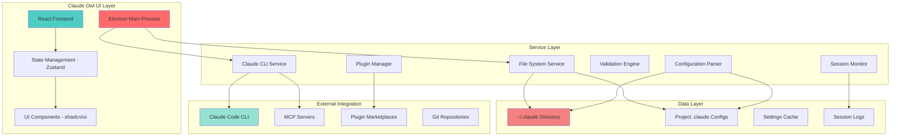

---

## 3. Component Architecture

### 3.1 Frontend Architecture

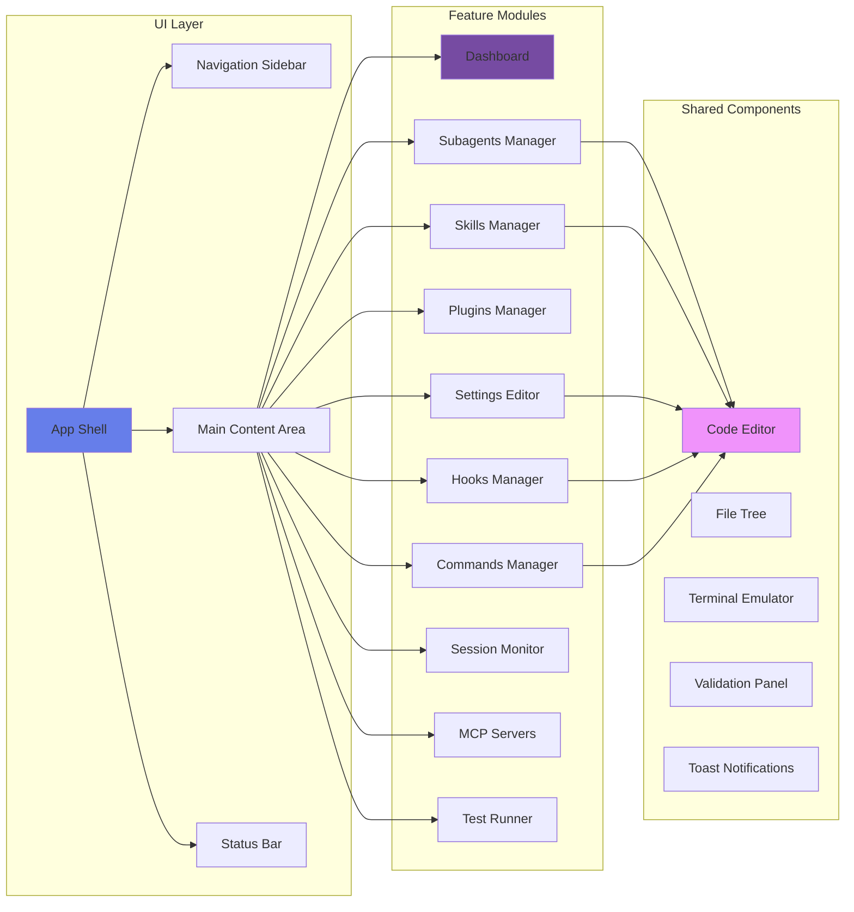

### 3.2 Backend Service Architecture

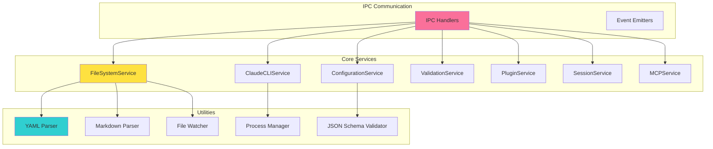

---

## 4. Data Flow Architecture

### 4.1 Configuration Read Flow

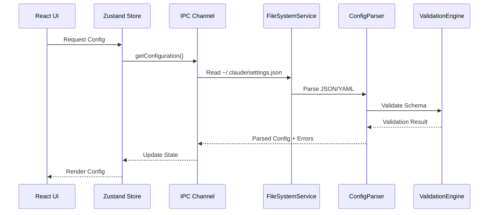

### 4.2 Configuration Write Flow

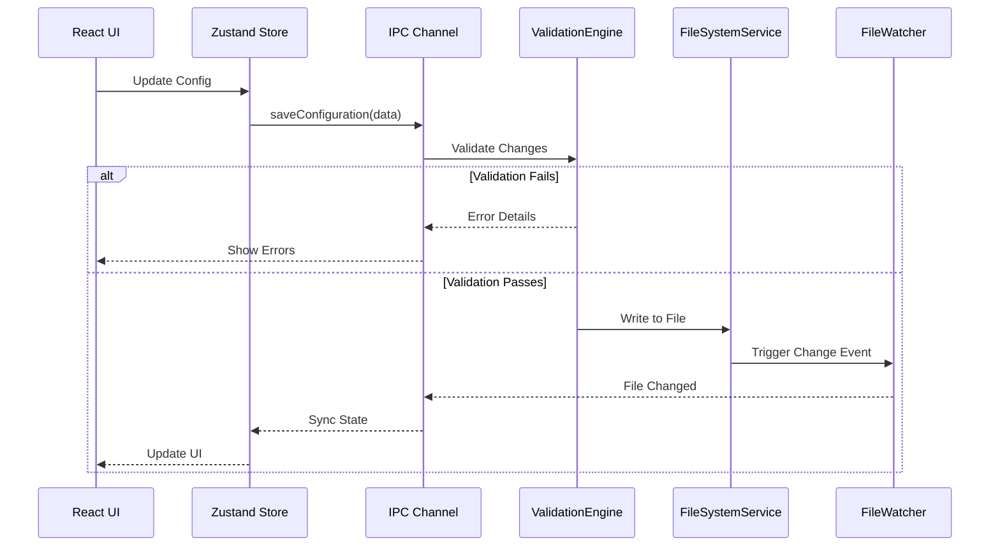

### 4.3 Claude CLI Execution Flow

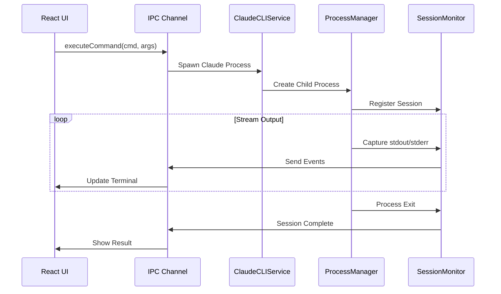

---

## 5. Module Design

### 5.1 Dashboard Module

**Purpose:** Provide overview of Claude Code health, recent activity, and quick actions

**Features:**
- Configuration status indicators (valid/invalid configs)
- Recent sessions list with outcomes
- Quick stats (plugins installed, agents count, hooks active)
- Resource usage metrics
- Quick action buttons (new agent, install plugin, run test)

**Technical Stack:**
- React with TypeScript
- Recharts for visualization
- Real-time updates via IPC events

### 5.2 Subagents Manager

**Purpose:** CRUD operations for subagents with visual editor

**Features:**
- Agent list with search/filter
- Visual YAML frontmatter editor
- Markdown preview for system prompts
- Tool permissions configurator
- Model selection dropdown
- Test agent functionality
- Import/export agents
- Template gallery

**File Operations:**
- Read/write `~/.claude/agents/*.md` and `.claude/agents/*.md`
- Parse YAML frontmatter
- Validate against schema

### 5.3 Skills Manager

**Purpose:** Manage agent skills with supporting files

**Features:**
- Skill browser with categories
- SKILL.md editor with frontmatter
- Supporting files manager (scripts, templates, docs)
- Skill activation testing
- Plugin skills viewer (read-only)
- Skill marketplace integration

**File Operations:**
- Manage `~/.claude/skills/` and `.claude/skills/`
- Handle multi-file skill packages
- Validate skill schema

### 5.4 Plugins Manager

**Purpose:** Discover, install, configure, and manage plugins

**Features:**
- Marketplace browser with search
- Plugin details viewer
- One-click install/uninstall
- Enable/disable toggles
- Local plugin development mode
- Custom marketplace addition
- Plugin dependency resolution
- Update notifications

**File Operations:**
- Read/write `~/.claude/plugins/installed_plugins.json`
- Manage `~/.claude/plugins/marketplaces/`
- Execute git operations for plugin installation
- Parse `.claude-plugin/plugin.json`

### 5.5 Settings Editor

**Purpose:** Visual editor for all Claude Code settings

**Features:**
- Hierarchical settings view (user/project/managed)
- Schema-driven form generation
- Settings validation with inline errors
- Environment variables manager
- Permission rules builder (allow/ask/deny)
- Model configuration
- API keys manager with secure storage
- Settings diff viewer
- Export/import configurations

**File Operations:**
- Read/write `~/.claude/settings.json`
- Read/write `.claude/settings.json` and `.claude/settings.local.json`
- Validate against JSON schema

### 5.6 Hooks Manager

**Purpose:** Configure event-driven hooks with validation

**Features:**
- Hook event browser (PreToolUse, PostToolUse, etc.)
- Hook builder with matcher configuration
- Script editor with syntax highlighting
- Bash command hooks
- Prompt-based hooks configuration
- Hook testing simulator
- Environment variable configurator
- Security validation (path traversal, quoting)

**File Operations:**
- Read/write `.claude/hooks.json`
- Validate hook scripts
- Test hook execution

### 5.7 Commands Manager

**Purpose:** Create and manage custom slash commands

**Features:**
- Command list with namespacing support
- Markdown editor for command content
- Frontmatter editor (description, allowed-tools, etc.)
- Argument configuration ($ARGUMENTS, $1, $2)
- Bash script integration
- File reference support (@prefix)
- Command testing interface
- Template library

**File Operations:**
- Manage `~/.claude/commands/` and `.claude/commands/`
- Parse Markdown with frontmatter
- Validate command syntax

### 5.8 Session Monitor

**Purpose:** Real-time monitoring and debugging of Claude sessions

**Features:**
- Active sessions list
- Live log streaming
- Tool usage visualization
- Token usage tracking
- Cost monitoring
- Error highlighting
- Session history browser
- Export session logs
- Performance metrics

**File Operations:**
- Read `~/.claude/history.jsonl`
- Monitor `~/.claude/debug/` logs
- Read session transcripts from `.claude/projects/`

### 5.9 MCP Servers Manager

**Purpose:** Configure and manage Model Context Protocol servers

**Features:**
- MCP server list
- Connection status indicators
- Server configuration editor (.mcp.json)
- Environment variables for servers
- Server logs viewer
- Tool discovery from MCP servers
- Connection testing
- Permission management

**File Operations:**
- Read/write `.mcp.json`
- Monitor MCP server processes
- Parse server capabilities

### 5.10 Test Runner

**Purpose:** Execute headless tests and automation workflows

**Features:**
- Test configuration builder
- Headless mode parameter editor
- Test execution with progress
- Output viewer (text/JSON/streaming)
- Test result history
- Automated test scheduling
- CI/CD integration snippets
- Test suite management

**Technical Stack:**
- Execute Claude CLI with `-p` flag
- Parse JSON output
- Process management

---

## 6. Technology Stack

### 6.1 Frontend Stack

| Technology | Purpose | Justification |
|------------|---------|---------------|
| **Electron** | Desktop application framework | Cross-platform, Node.js integration, native OS features |
| **React 18** | UI framework | Component reusability, ecosystem, performance |
| **TypeScript** | Type safety | Better DX, fewer runtime errors, IDE support |
| **Vite** | Build tool | Fast HMR, modern tooling, optimized builds |
| **Zustand** | State management | Simple API, minimal boilerplate, TypeScript support |
| **TanStack Query** | Server state | Caching, background updates, optimistic UI |
| **shadcn/ui** | Component library | Customizable, accessible, Tailwind-based |
| **Tailwind CSS** | Styling | Utility-first, rapid development, consistent design |
| **Monaco Editor** | Code editing | VSCode editor, syntax highlighting, IntelliSense |
| **xterm.js** | Terminal emulator | VT100 compatible, performance, customizable |
| **Recharts** | Data visualization | React-native, declarative, responsive |
| **React Hook Form** | Form management | Performance, validation, DevX |
| **Zod** | Schema validation | TypeScript-first, composable, runtime validation |

### 6.2 Backend Stack (Electron Main)

| Technology | Purpose | Justification |
|------------|---------|---------------|
| **Node.js** | Runtime | Electron requirement, npm ecosystem |
| **TypeScript** | Type safety | Shared types with frontend |
| **child_process** | CLI execution | Spawn Claude CLI processes |
| **fs-extra** | File operations | Enhanced fs with promises |
| **chokidar** | File watching | Reliable cross-platform file watching |
| **yaml** | YAML parsing | Handle agent/skill frontmatter |
| **gray-matter** | Markdown frontmatter | Parse command/agent files |
| **ajv** | JSON schema validation | Fast, standard-compliant validation |
| **execa** | Process execution | Better child_process API |
| **p-queue** | Async queue | Rate limiting, concurrency control |

### 6.3 Development Tools

| Tool | Purpose |
|------|---------|
| **ESLint** | Code linting |
| **Prettier** | Code formatting |
| **Vitest** | Unit testing |
| **Playwright** | E2E testing |
| **electron-builder** | Application packaging |
| **Storybook** | Component development |
| **Biome** | Fast linter/formatter alternative |

---

## 7. Security Architecture

### 7.1 Security Considerations

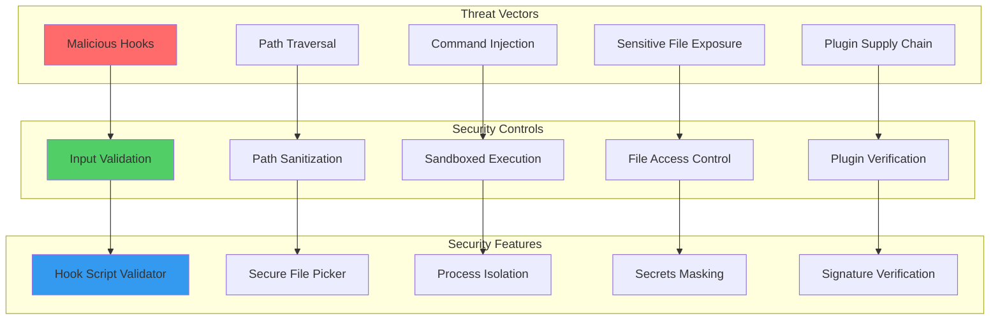

### 7.2 Security Measures

**Input Validation:**
- Validate all user inputs against schemas
- Sanitize file paths to prevent traversal
- Escape shell arguments
- Validate hook scripts for dangerous patterns

**File System Security:**
- Restrict access to `~/.claude` and project `.claude`
- Prevent reading sensitive files (.env, .git/config)
- Validate file permissions before operations
- Use secure file dialogs for user selection

**Process Isolation:**
- Run Claude CLI in separate processes
- Limit process permissions
- Implement timeout controls
- Monitor resource usage

**Secrets Management:**
- Mask API keys in UI
- Use OS keychain for credential storage
- Prevent logging sensitive data
- Secure IPC communication

**Plugin Security:**
- Verify plugin signatures (future)
- Scan for malicious code patterns
- Display permissions before installation
- Sandbox plugin execution (future)

---

## 8. Performance Architecture

### 8.1 Performance Optimizations

**Frontend:**
- React.memo for expensive components
- Virtual scrolling for large lists (react-window)
- Code splitting by route
- Lazy loading of Monaco Editor
- Debounced search and validation
- Optimistic UI updates

**Backend:**
- File system caching with invalidation
- Async operations with p-queue
- Streaming large file reads
- Efficient file watching with chokidar
- Process pooling for CLI executions
- Incremental parsing for large configs

**Data Transfer:**
- Compress large payloads over IPC
- Batch IPC calls where possible
- Stream terminal output
- Paginate session history

### 8.2 Scalability Considerations

**Large Configurations:**
- Support 100+ agents/skills
- Handle large plugin marketplaces
- Efficient search/filter algorithms
- Pagination for lists

**Long-Running Sessions:**
- Stream processing for logs
- Log rotation for session history
- Memory-efficient monitoring
- Background cleanup tasks

---

## 9. Error Handling Architecture

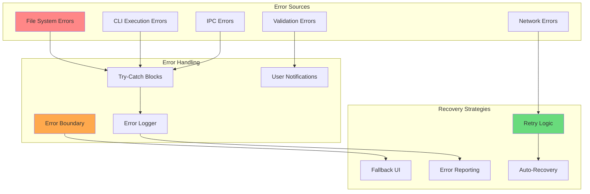

### 9.1 Error Handling Strategy

**User-Facing Errors:**
- Clear, actionable error messages
- Validation errors inline with fields
- Toast notifications for background operations
- Error details in expandable sections
- Suggested fixes when possible

**Developer Errors:**
- Detailed logs in `~/.claude/debug/`
- Stack traces in development mode
- Error reporting to telemetry (opt-in)
- Debug mode for verbose logging

**Recovery Mechanisms:**
- Automatic retry for transient errors
- Graceful degradation for missing features
- Configuration backup and restore
- Safe mode for corrupted configs

---

## 10. Integration Architecture

### 10.1 Claude Code CLI Integration

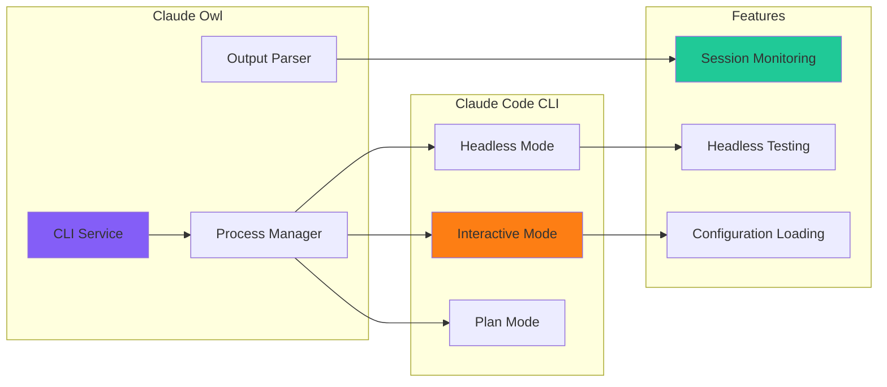

**Integration Points:**
- Execute `claude` CLI with various flags
- Parse stdout/stderr streams
- Monitor process lifecycle
- Pass configuration flags
- Handle interactive prompts (future)

### 10.2 Git Integration

**Features:**
- Commit and push `.claude/` configs
- Detect git repository
- Show config diff before commit
- Branch-specific configurations
- .gitignore recommendations

### 10.3 MCP Server Integration

**Features:**
- Discover MCP servers from `.mcp.json`
- Connect to local and remote servers
- Proxy MCP protocol
- Display available tools
- Configure server permissions

### 10.4 Plugin Marketplace Integration

**Features:**
- Fetch marketplace manifests
- Clone plugin repositories
- Check for updates
- Install dependencies
- Manage multiple marketplaces

---

## 11. Deployment Architecture

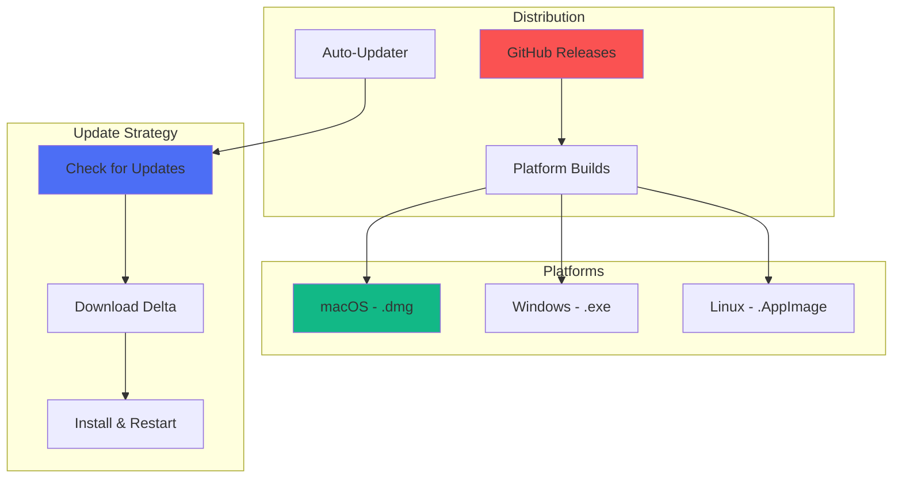

### 11.1 Build Pipeline

**CI/CD:**
- GitHub Actions for builds
- Platform-specific runners
- Code signing for macOS/Windows
- Automated testing before release
- Release notes generation

**Packaging:**
- electron-builder for all platforms
- Code signing certificates
- Auto-update configuration
- Installer customization

### 11.2 Update Mechanism

**Auto-Updates:**
- Check for updates on startup
- Background downloads
- User notification
- Automatic installation (optional)
- Rollback capability

---

## 12. Extensibility Architecture

### 12.1 Plugin System

**Claude Owl Plugins** (separate from Claude Code plugins):
- UI extensions API
- Custom views/panels
- Tool integrations
- Theme system
- Keyboard shortcuts

### 12.2 Theming

**Theme System:**
- Light/dark/auto modes
- Custom color schemes
- Font customization
- Layout preferences
- Accessibility options

---

## 13. Accessibility Architecture

**WCAG 2.1 Compliance:**
- Keyboard navigation
- Screen reader support
- High contrast mode
- Focus management
- ARIA labels
- Semantic HTML

**Accessibility Features:**
- Keyboard shortcuts
- Customizable font sizes
- Color blind friendly palettes
- Reduced motion mode

---

## 14. Testing Architecture

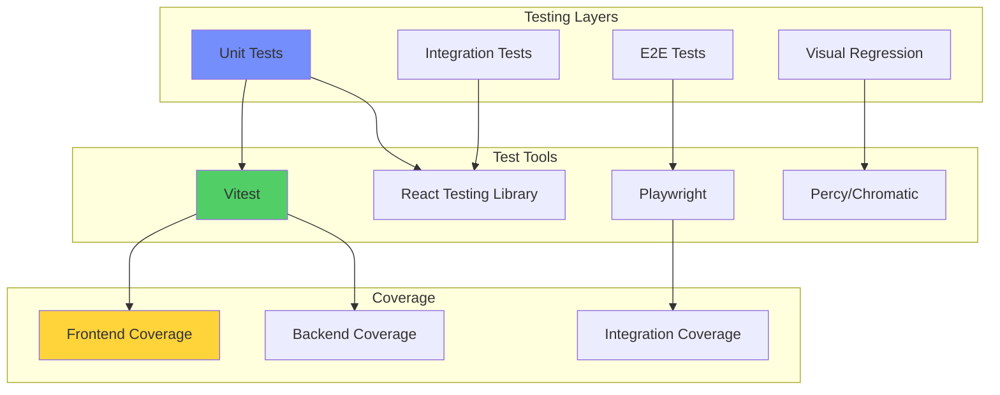

**Testing Strategy:**
- Unit tests for utilities and services
- Component tests with React Testing Library
- Integration tests for IPC communication
- E2E tests for critical user flows
- Visual regression for UI consistency
- Performance benchmarks

---

## 15. Future Architecture Considerations

### 15.1 Planned Enhancements

**Cloud Sync:**
- Sync configurations across devices
- Team configuration sharing
- Cloud backup

**Collaborative Features:**
- Real-time collaboration on configs
- Shared agent library
- Team dashboards

**AI-Powered Features:**
- Configuration suggestions
- Error diagnosis
- Optimization recommendations
- Natural language configuration

**Mobile Companion:**
- Monitor sessions on mobile
- Quick actions
- Notifications

### 15.2 Architecture Scalability

**Multi-User Support:**
- User profiles
- Role-based access control
- Organization management

**Enterprise Features:**
- Centralized policy management
- Audit logging
- Compliance reporting
- SSO integration

---

## 16. Architecture Principles

### 16.1 Design Principles

1. **User-Centric**: Prioritize ease of use over feature completeness
2. **Transparent**: Show what Claude Code is doing, no magic
3. **Safe**: Validate before destructive operations, enable undo
4. **Fast**: Responsive UI, background operations
5. **Extensible**: Plugin architecture, customizable
6. **Accessible**: WCAG compliant, keyboard-first
7. **Offline-First**: Core features work without network
8. **Privacy-Respecting**: Local-first, no telemetry by default

### 16.2 Technical Principles

1. **Type Safety**: TypeScript everywhere
2. **Immutability**: Functional patterns, avoid mutations
3. **Composition**: Small, composable components
4. **Separation of Concerns**: Clear boundaries between layers
5. **Error Handling**: Graceful failures, helpful messages
6. **Testing**: High coverage, test-driven development
7. **Performance**: Measure and optimize
8. **Security**: Defense in depth, least privilege

---

## 17. Conclusion

Claude Owl provides a comprehensive UI for Claude Code, making advanced configuration accessible through visual interfaces while maintaining the power and flexibility of the CLI. The architecture balances simplicity for beginners with advanced features for power users, ensuring scalability and extensibility for future growth.

**Next Steps:**
1. Review and validate architecture with stakeholders
2. Create detailed technical specifications for each module
3. Define API contracts between frontend and backend
4. Establish coding standards and contribution guidelines
5. Begin implementation with MVP features
